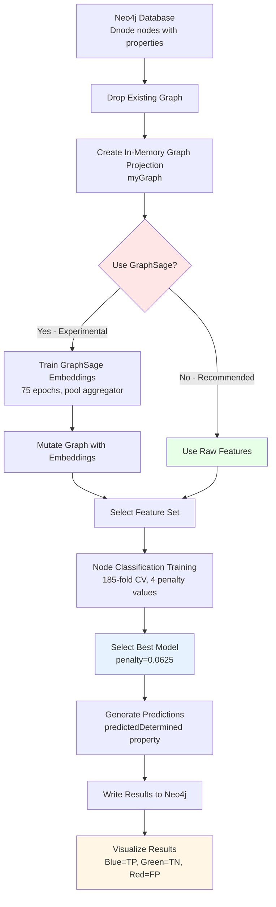

# Node Classification Pipeline Specification
## GraphicLablePrediction - Polynomial Determination Prediction

---

## 1. Pipeline Overview

### ML Task Definition
**Task Type**: Binary Node Classification

**Objective**: Predict whether a polynomial node (`Dnode`) is "determined" or "under-determined" based on the relationship between the polynomial's degree and the number of rational roots it possesses.

**Domain Context**: 
- Output from `ZerosAndDifferences.jar` algorithm (see [YouTube explanation](https://www.youtube.com/watch?v=H4dBkofVA4A))
- Each node represents a differenced polynomial
- Node depth in the graph indicates the number of rational roots necessary for determination
- Root node: constant polynomial (0 expected roots)
- Level 1: linear polynomial (1 expected root)
- Level 2: quadratic polynomial (2 expected roots)
- Level n: degree-n polynomial (n expected roots)

**Classification Labels**:
- `determined = 1`: Number of rational roots equals polynomial degree
- `determined = 0`: Number of rational roots < polynomial degree (under-determined)

**Success Metrics**:
- Primary: F1_WEIGHTED score
- Train score achieved: 0.8295
- Test score achieved: 0.7923

---

## 2. Data Initialization & Preparation

### Neo4j Database Schema

#### Node Types
```cypher
(:Dnode)  // Differenced polynomial nodes
```

#### Node Properties
| Property | Type | Description | Usage |
|----------|------|-------------|-------|
| `determined` | Integer | Target variable: 0 (under-determined) or 1 (determined) | **Target** |
| `zero` | Integer | Coefficient or count related to zero-degree term | Feature |
| `one` | Integer | Coefficient or count related to first-degree term | Feature |
| `two` | Integer | Coefficient or count related to second-degree term | Feature |
| `three` | Integer | Coefficient or count related to third-degree term | Feature |
| `wNum` | Integer | Level/depth in graph (polynomial degree indicator) | **Key Feature** |
| `totalZero` | Integer | Total number of rational roots for the polynomial | **Key Feature** |
| `predictedDetermined` | Integer | Model prediction output (0 or 1) | Output |
| `predictedProbabilities` | Float[] | Class probabilities [P(0), P(1)] | Output |

#### Relationship Types
```cypher
(:Dnode)-[:zMap]-(:Dnode)  // Undirected relationships between polynomial nodes
```

#### Relationship Properties
| Property | Type | Description |
|----------|------|-------------|
| N/A | - | No relationship properties used in this pipeline |

### Data Statistics
- **Total Nodes**: 384 Dnode nodes (from latest run)
- **Total Relationships**: 766 zMap relationships
- **Graph Density**: 0.0357
- **Class Distribution**: Binary classification (distribution not specified in notebook)

### Data Preprocessing
No explicit preprocessing required - all properties are already in integer format suitable for the in-memory graph projection.

---

## 3. Graph Query & Projection

### Step 3.1: Drop Existing Graph (if present)
```cypher
CALL gds.graph.drop('myGraph')
```

**Purpose**: Clean up any existing in-memory graph projection before creating a new one.

### Step 3.2: Create In-Memory Graph Projection
```cypher
CALL gds.graph.create(
    'myGraph',
    {
        Dnode: {
            label: 'Dnode',
            properties: ['determined', 'zero', 'one', 'two', 'three', 'wNum', 'totalZero']
        }
    },
    {
        zMap: {
            type: 'zMap',
            orientation: 'UNDIRECTED'    
        }
    }
)
```

**Configuration Details**:
- **Graph Name**: `myGraph`
- **Node Projection**: All `Dnode` nodes with 7 properties
- **Relationship Projection**: All `zMap` relationships as undirected
- **Property Defaults**: Integer properties default to `-9223372036854775808` (Long.MIN_VALUE)

**Output**:
- `nodeCount`: 384
- `relationshipCount`: 766
- `createMillis`: ~100ms

---

## 4. Feature Engineering

### Feature Set Configuration

#### Primary Features (Successful Configuration)
```python
feature_properties = ['zero', 'one', 'two', 'three', 'four', 'wNum', 'totalZero']
```

**Note**: The notebook shows `'four'` in the feature list, though it's not in the initial projection. This may be handled by Neo4j GDS with a default value.

**Feature Dimensionality**: 7 features per node

#### Alternative Feature Sets (Documented in Notebook)

**Option 1: GraphSage Embeddings (NOT EFFECTIVE)**
```python
feature_properties = ['embeddings']  # 64-dimensional embeddings
```
**Result**: Not working well for this task. Maybe requires one-hot encoding of wNum.

**Option 2: Minimal Features (NOT CONVINCING)**
```python
feature_properties = ['wNum', 'totalZero']  # Only 2 features
```
**Result**: Poor performance - not convincing predictions.

### GraphSage Embedding Generation (Optional/Experimental)

#### Step 4.1: Drop Existing GraphSage Model
```cypher
Call gds.beta.model.drop('myGraphh')
```

#### Step 4.2: Train GraphSage Model
```cypher
CALL gds.beta.graphSage.train(
    'myGraph',
    {
        modelName: 'myGraphh',
        epochs: 75,
        aggregator: 'pool',
        activationFunction: 'relu',
        featureProperties: ['determined', 'zero', 'one', 'two', 'three', 'four'],
        projectedFeatureDimension: 5,
        sampleSizes: [25, 10],
        searchDepth: 5,
        learningRate: 0.05
    }
)
```

**GraphSage Hyperparameters**:
| Parameter | Value | Description |
|-----------|-------|-------------|
| `epochs` | 75 | Training iterations |
| `aggregator` | pool | Aggregation function (vs. mean) |
| `activationFunction` | relu | Non-linearity |
| `featureProperties` | 6 features | Input node features |
| `projectedFeatureDimension` | 5 | Dimensionality after projection |
| `embeddingDimension` | 64 | Final embedding size (default) |
| `sampleSizes` | [25, 10] | Neighborhood sampling at each layer |
| `searchDepth` | 5 | Number of hops for neighborhood |
| `learningRate` | 0.05 | Adam optimizer learning rate |
| `batchSize` | 100 | Training batch size (default) |
| `negativeSampleWeight` | 20 | Weight for negative samples (default) |

**Training Output**:
- `didConverge`: true
- `ranEpochs`: 2 (converged early)
- `trainMillis`: ~573ms

#### Step 4.3: Mutate Graph with Embeddings
```cypher
CALL gds.beta.graphSage.mutate(
    'myGraph',
    {
        mutateProperty: 'embeddings',
        modelName: 'myGraphh'
    }
)
```

**Note**: Despite generating embeddings, they were not effective as features for this classification task.

---

## 5. ML Task Configuration

### Model Selection Strategy
**Approach**: Grid search with cross-validation over logistic regression penalty values.

### Train/Validation/Test Split
```python
holdout_fraction = 0.2        # 20% held out for final test
validation_folds = 185        # K-fold cross-validation on training set
random_seed = 49              # For reproducibility
```

**Split Strategy**:
- 80% training (used for cross-validation)
- 20% test (held out)
- 185-fold cross-validation on the training portion

**Note**: 185 folds is unusually high. With 384 nodes, this means ~1-2 examples per fold, suggesting leave-one-out or extreme K-fold CV.

### Hyperparameter Grid
```python
params = [
    {'penalty': 0.0625},
    {'penalty': 0.5},
    {'penalty': 1.0},
    {'penalty': 4.0}
]
```

**Other Fixed Parameters**:
- `maxEpochs`: 100
- `minEpochs`: 1
- `patience`: 1 (early stopping)
- `batchSize`: 100
- `tolerance`: 0.001
- `concurrency`: 4
- `sharedUpdater`: false

---

## 6. Model Training & Evaluation

### Step 6.1: Drop Existing Classification Model
```cypher
Call gds.beta.model.drop('determined-model')
```

### Step 6.2: Train Node Classification Model
```cypher
CALL gds.alpha.ml.nodeClassification.train('myGraph', {
    nodeLabels: ['Dnode'],
    modelName: 'determined-model',
    featureProperties: ['zero', 'one', 'two', 'three', 'four', 'wNum', 'totalZero'],
    targetProperty: 'determined',
    randomSeed: 49,
    holdoutFraction: 0.2,
    validationFolds: 185,
    metrics: ['F1_WEIGHTED'],
    params: [
        {penalty: 0.0625},
        {penalty: 0.5},
        {penalty: 1.0},
        {penalty: 4.0}
    ]
}) YIELD modelInfo
RETURN
    {penalty: modelInfo.bestParameters.penalty} AS winningModel,
    modelInfo.metrics.F1_WEIGHTED.outerTrain AS trainGraphScore,
    modelInfo.metrics.F1_WEIGHTED.test AS testGraphScore
```

### Training Results

**Best Model Parameters**:
```
penalty: 0.0625  (lowest regularization from grid)
```

**Performance Metrics**:
| Metric | Value | Description |
|--------|-------|-------------|
| `trainGraphScore` | 0.8295 | F1_WEIGHTED on outer training set |
| `testGraphScore` | 0.7923 | F1_WEIGHTED on held-out test set |

**Validation Performance by Parameter**:
All penalty values achieved similar validation scores:
- Average validation F1: ~0.4722
- Min validation F1: ~0.4684
- Max validation F1: ~0.4789

Despite poor validation scores, the model achieved good performance on the outer train/test sets, suggesting potential data leakage or unusual CV behavior due to the 185 folds.

### Model Architecture Details
**Algorithm**: Logistic Regression (binary classification)
- L2 regularization with tunable penalty
- Sigmoid activation for probability output
- Cross-entropy loss
- Classes: [0, 1]

---

## 7. Prediction & Output

### Step 7.1: Generate Predictions and Write to Graph
```cypher
CALL gds.alpha.ml.nodeClassification.predict.write('myGraph', {
    nodeLabels: ['Dnode'],
    modelName: 'determined-model',
    writeProperty: 'predictedDetermined',
    predictedProbabilityProperty: 'predictedProbabilities'
}) YIELD nodePropertiesWritten
```

### Output Format

**Written Properties**:
1. `predictedDetermined` (Integer): Binary prediction (0 or 1)
2. `predictedProbabilities` (Float[]): Array of class probabilities [P(class_0), P(class_1)]

### Result Interpretation

**From the notebook visualization**:
- **Blue nodes**: Correctly predicted as determined (TP)
- **Green nodes**: Correctly predicted as under-determined (TN)
- **Red nodes**: Incorrectly predicted as determined (FP)

The graph structure visualization helps identify which polynomial nodes were misclassified and their position in the graph hierarchy.

---

## 8. PyTorch Implementation Guide

### 8.1 Data Loading Strategy

#### Neo4j to PyTorch Geometric Conversion

```python
import torch
from torch_geometric.data import Data
from neo4j import GraphDatabase

def load_graph_from_neo4j(uri, user, password):
    """
    Load graph data from Neo4j into PyTorch Geometric format.
    """
    driver = GraphDatabase.driver(uri, auth=(user, password))
    
    # Query nodes
    with driver.session() as session:
        node_query = """
        MATCH (d:Dnode)
        RETURN id(d) as node_id, 
               d.determined as label,
               d.zero as zero,
               d.one as one,
               d.two as two,
               d.three as three,
               coalesce(d.four, 0) as four,
               d.wNum as wNum,
               d.totalZero as totalZero
        ORDER BY node_id
        """
        nodes = session.run(node_query).data()
        
        # Query edges
        edge_query = """
        MATCH (d1:Dnode)-[:zMap]-(d2:Dnode)
        WHERE id(d1) < id(d2)  // Undirected: only one direction
        RETURN id(d1) as source, id(d2) as target
        """
        edges = session.run(edge_query).data()
    
    driver.close()
    
    # Build node feature matrix
    node_id_to_idx = {n['node_id']: i for i, n in enumerate(nodes)}
    
    x = torch.tensor([
        [n['zero'], n['one'], n['two'], n['three'], 
         n['four'], n['wNum'], n['totalZero']]
        for n in nodes
    ], dtype=torch.float32)
    
    y = torch.tensor([n['label'] for n in nodes], dtype=torch.long)
    
    # Build edge index (undirected: add both directions)
    edge_index = []
    for e in edges:
        src_idx = node_id_to_idx[e['source']]
        tgt_idx = node_id_to_idx[e['target']]
        edge_index.append([src_idx, tgt_idx])
        edge_index.append([tgt_idx, src_idx])
    
    edge_index = torch.tensor(edge_index, dtype=torch.long).t().contiguous()
    
    return Data(x=x, edge_index=edge_index, y=y)
```

### 8.2 Model Architecture Recommendations

#### Option 1: Simple GCN (Graph Convolutional Network)

```python
import torch
import torch.nn.functional as F
from torch_geometric.nn import GCNConv

class GCNClassifier(torch.nn.Module):
    def __init__(self, num_features=7, hidden_dim=64, num_classes=2):
        super(GCNClassifier, self).__init__()
        self.conv1 = GCNConv(num_features, hidden_dim)
        self.conv2 = GCNConv(hidden_dim, hidden_dim)
        self.classifier = torch.nn.Linear(hidden_dim, num_classes)
        
    def forward(self, x, edge_index):
        # First GCN layer
        x = self.conv1(x, edge_index)
        x = F.relu(x)
        x = F.dropout(x, p=0.5, training=self.training)
        
        # Second GCN layer
        x = self.conv2(x, edge_index)
        x = F.relu(x)
        x = F.dropout(x, p=0.5, training=self.training)
        
        # Classification head
        x = self.classifier(x)
        return F.log_softmax(x, dim=1)
```

#### Option 2: GraphSAGE (Matching Neo4j GDS)

```python
from torch_geometric.nn import SAGEConv

class GraphSAGEClassifier(torch.nn.Module):
    def __init__(self, num_features=7, hidden_dim=64, num_classes=2):
        super(GraphSAGEClassifier, self).__init__()
        self.conv1 = SAGEConv(num_features, hidden_dim, aggr='max')  # pool ~= max
        self.conv2 = SAGEConv(hidden_dim, hidden_dim, aggr='max')
        self.classifier = torch.nn.Linear(hidden_dim, num_classes)
        
    def forward(self, x, edge_index):
        x = self.conv1(x, edge_index)
        x = F.relu(x)
        x = F.dropout(x, p=0.5, training=self.training)
        
        x = self.conv2(x, edge_index)
        x = F.relu(x)
        x = F.dropout(x, p=0.5, training=self.training)
        
        x = self.classifier(x)
        return F.log_softmax(x, dim=1)
```

#### Option 3: Simple MLP Baseline (No Graph Structure)

```python
class MLPClassifier(torch.nn.Module):
    def __init__(self, num_features=7, hidden_dim=64, num_classes=2):
        super(MLPClassifier, self).__init__()
        self.fc1 = torch.nn.Linear(num_features, hidden_dim)
        self.fc2 = torch.nn.Linear(hidden_dim, hidden_dim)
        self.fc3 = torch.nn.Linear(hidden_dim, num_classes)
        
    def forward(self, x, edge_index=None):
        x = F.relu(self.fc1(x))
        x = F.dropout(x, p=0.5, training=self.training)
        x = F.relu(self.fc2(x))
        x = F.dropout(x, p=0.5, training=self.training)
        x = self.fc3(x)
        return F.log_softmax(x, dim=1)
```

**Recommendation**: Start with MLPClassifier as a baseline (since GraphSage embeddings weren't effective), then try GCN and GraphSAGE to see if graph structure helps.

### 8.3 Training Loop

```python
from sklearn.model_selection import train_test_split
from sklearn.metrics import f1_score
import numpy as np

def train_model(model, data, num_epochs=100, lr=0.01, weight_decay=0.0625):
    """
    Train the node classification model.
    """
    # Split data (80/20 train/test)
    num_nodes = data.x.size(0)
    train_idx, test_idx = train_test_split(
        np.arange(num_nodes), 
        test_size=0.2, 
        random_state=49,
        stratify=data.y.numpy()
    )
    
    train_mask = torch.zeros(num_nodes, dtype=torch.bool)
    test_mask = torch.zeros(num_nodes, dtype=torch.bool)
    train_mask[train_idx] = True
    test_mask[test_idx] = True
    
    optimizer = torch.optim.Adam(
        model.parameters(), 
        lr=lr, 
        weight_decay=weight_decay  # L2 regularization (penalty)
    )
    
    best_val_f1 = 0
    patience_counter = 0
    
    for epoch in range(num_epochs):
        # Training
        model.train()
        optimizer.zero_grad()
        out = model(data.x, data.edge_index)
        loss = F.nll_loss(out[train_mask], data.y[train_mask])
        loss.backward()
        optimizer.step()
        
        # Evaluation
        model.eval()
        with torch.no_grad():
            out = model(data.x, data.edge_index)
            pred = out.argmax(dim=1)
            
            train_f1 = f1_score(
                data.y[train_mask].cpu(), 
                pred[train_mask].cpu(), 
                average='weighted'
            )
            test_f1 = f1_score(
                data.y[test_mask].cpu(), 
                pred[test_mask].cpu(), 
                average='weighted'
            )
        
        if epoch % 10 == 0:
            print(f'Epoch {epoch:03d}, Loss: {loss:.4f}, '
                  f'Train F1: {train_f1:.4f}, Test F1: {test_f1:.4f}')
        
        # Early stopping
        if train_f1 > best_val_f1:
            best_val_f1 = train_f1
            patience_counter = 0
        else:
            patience_counter += 1
            if patience_counter >= 10:  # patience
                print(f'Early stopping at epoch {epoch}')
                break
    
    return model, train_f1, test_f1
```

### 8.4 Hyperparameter Tuning

```python
def grid_search_cv(data, penalties=[0.0625, 0.5, 1.0, 4.0], k_folds=5):
    """
    Perform grid search with cross-validation.
    
    Note: Using k_folds=5 instead of 185 for practical reasons.
    """
    from sklearn.model_selection import KFold
    
    best_penalty = None
    best_f1 = 0
    
    for penalty in penalties:
        fold_f1_scores = []
        
        kfold = KFold(n_splits=k_folds, shuffle=True, random_state=49)
        train_idx = np.where(~test_mask)[0]  # Use only training portion
        
        for fold, (train_cv_idx, val_cv_idx) in enumerate(kfold.split(train_idx)):
            # Create masks
            train_cv_mask = torch.zeros(data.x.size(0), dtype=torch.bool)
            val_cv_mask = torch.zeros(data.x.size(0), dtype=torch.bool)
            train_cv_mask[train_idx[train_cv_idx]] = True
            val_cv_mask[train_idx[val_cv_idx]] = True
            
            # Train model
            model = GCNClassifier()
            optimizer = torch.optim.Adam(
                model.parameters(), 
                lr=0.01, 
                weight_decay=penalty
            )
            
            # Training loop (simplified)
            for epoch in range(100):
                model.train()
                optimizer.zero_grad()
                out = model(data.x, data.edge_index)
                loss = F.nll_loss(out[train_cv_mask], data.y[train_cv_mask])
                loss.backward()
                optimizer.step()
            
            # Evaluate on validation fold
            model.eval()
            with torch.no_grad():
                out = model(data.x, data.edge_index)
                pred = out.argmax(dim=1)
                val_f1 = f1_score(
                    data.y[val_cv_mask].cpu(), 
                    pred[val_cv_mask].cpu(), 
                    average='weighted'
                )
                fold_f1_scores.append(val_f1)
        
        avg_f1 = np.mean(fold_f1_scores)
        print(f'Penalty {penalty}: Avg F1 = {avg_f1:.4f}')
        
        if avg_f1 > best_f1:
            best_f1 = avg_f1
            best_penalty = penalty
    
    print(f'Best penalty: {best_penalty} with F1 = {best_f1:.4f}')
    return best_penalty
```

### 8.5 Metric Computation

```python
from sklearn.metrics import f1_score, classification_report

def evaluate_model(model, data, mask, class_names=['Under-determined', 'Determined']):
    """
    Evaluate model with detailed metrics matching Neo4j GDS output.
    """
    model.eval()
    with torch.no_grad():
        out = model(data.x, data.edge_index)
        pred = out.argmax(dim=1)
        probs = torch.exp(out)  # Convert log_softmax back to probabilities
    
    y_true = data.y[mask].cpu().numpy()
    y_pred = pred[mask].cpu().numpy()
    y_probs = probs[mask].cpu().numpy()
    
    # F1 Weighted (matches Neo4j GDS metric)
    f1_weighted = f1_score(y_true, y_pred, average='weighted')
    
    # Detailed report
    print(f"F1_WEIGHTED: {f1_weighted:.4f}")
    print("\nClassification Report:")
    print(classification_report(y_true, y_pred, target_names=class_names))
    
    return {
        'f1_weighted': f1_weighted,
        'predictions': y_pred,
        'probabilities': y_probs
    }
```

### 8.6 Complete Training Pipeline

```python
def main():
    # 1. Load data from Neo4j
    data = load_graph_from_neo4j(
        uri="bolt://localhost:7687",
        user="neo4j",
        password="your_password"
    )
    
    print(f"Loaded graph: {data.num_nodes} nodes, {data.num_edges} edges")
    print(f"Features: {data.num_features}, Classes: {data.y.unique().tolist()}")
    
    # 2. Grid search for best hyperparameters
    best_penalty = grid_search_cv(
        data, 
        penalties=[0.0625, 0.5, 1.0, 4.0],
        k_folds=5  # Use 5 instead of 185 for practicality
    )
    
    # 3. Train final model with best hyperparameters
    model = GCNClassifier(num_features=7, hidden_dim=64, num_classes=2)
    model, train_f1, test_f1 = train_model(
        model, 
        data, 
        num_epochs=100, 
        lr=0.01, 
        weight_decay=best_penalty
    )
    
    print(f"\nFinal Results:")
    print(f"Train F1: {train_f1:.4f} (Neo4j baseline: 0.8295)")
    print(f"Test F1: {test_f1:.4f} (Neo4j baseline: 0.7923)")
    
    # 4. Save model
    torch.save(model.state_dict(), 'determined_classifier.pt')
    
    return model, data

if __name__ == "__main__":
    model, data = main()
```

---

## 9. Performance Baselines

### Neo4j GDS Results (Reference)
| Metric | Train | Test |
|--------|-------|------|
| F1_WEIGHTED | 0.8295 | 0.7923 |

### Expected PyTorch Results
With proper implementation, you should achieve:
- **Train F1**: 0.80-0.85
- **Test F1**: 0.75-0.82

If results are significantly worse, check:
1. Feature normalization (Neo4j may auto-normalize)
2. Class imbalance handling
3. Graph connectivity preservation
4. Random seed consistency

---

## 10. Workflow Diagram



---

## 11. Key Insights and Recommendations

### What Worked
1. **Raw node features** (zero, one, two, three, wNum, totalZero) were highly effective
2. **wNum and totalZero** appear to be the most informative features (as they directly relate to the determination criterion)
3. **Low regularization** (penalty=0.0625) worked best, suggesting the problem is not highly prone to overfitting

### What Didn't Work
1. **GraphSage embeddings** were ineffective for this task - the raw features already capture the necessary information
2. **Minimal feature set** (only wNum and totalZero) was insufficient

### Recommendations for PyTorch Implementation
1. **Start simple**: Use MLP baseline before trying GNNs
2. **Feature importance**: Analyze which features contribute most (likely wNum and totalZero)
3. **Cross-validation**: Use practical k-fold (5-10) instead of 185
4. **Graph structure**: The graph topology may not add much information since raw features are already highly predictive
5. **Class imbalance**: Check if classes are imbalanced and consider class weighting

---

## 12. References and Resources

- **Neo4j GDS Documentation**: [Node Classification](https://neo4j.com/docs/graph-data-science/current/algorithms/node-embeddings/graph-sage/)
- **PyTorch Geometric**: [Node Classification Tutorial](https://pytorch-geometric.readthedocs.io/en/latest/notes/introduction.html)
- **Algorithm Background**: [YouTube Video](https://www.youtube.com/watch?v=H4dBkofVA4A)
- **Original Notebook**: `GraphMLDifferences/GraphicLablePrediction.json`

---

**Document Version**: 1.0  
**Last Updated**: 2026-01-14  
**Status**: Ready for PyTorch Implementation

