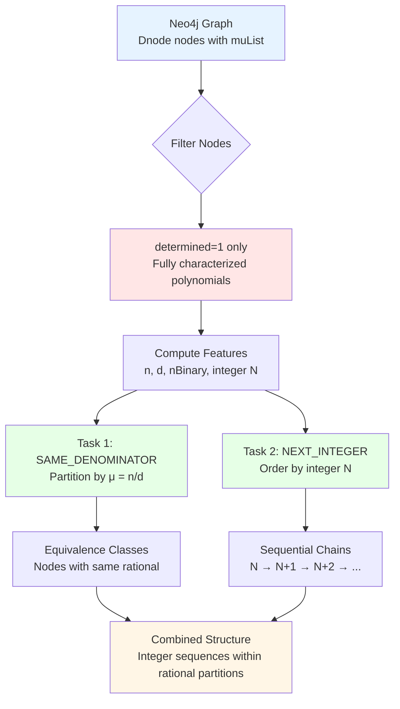
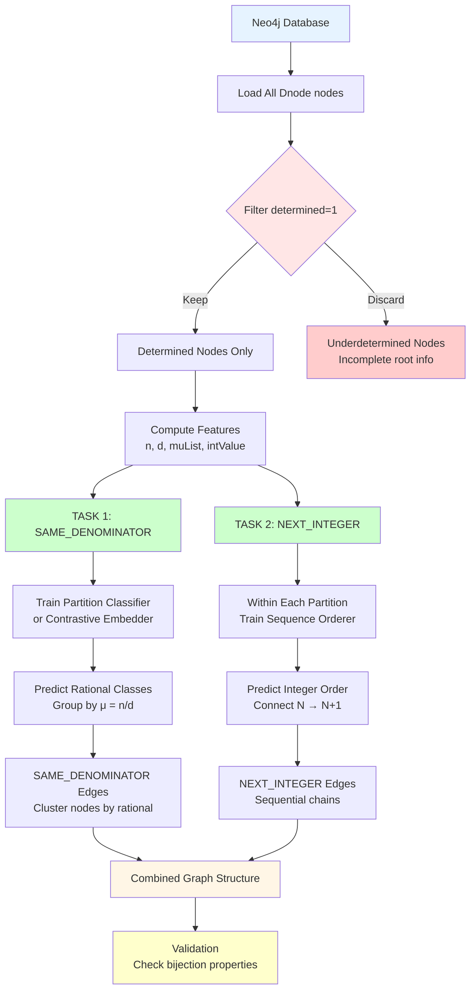

# Link Prediction Pipeline Specification
## Two ML Tasks: Sequential Integer Ordering and Rational Partitioning

---

## ⚠️ Important Clarification: What This Specification Is NOT About

### The `:zMap` Relationship Is NOT an ML Target

**Critical Understanding**: The existing Zeppelin notebook `GraphicLinkPrediction.json` documents a pipeline that predicts `:zMap` relationships. However, **`:zMap` is a structural relationship** that exists by construction and should NOT be the target of machine learning prediction.

#### What `:zMap` Actually Represents

```cypher
(:Dnode)-[:zMap]->(:Dnode)
```

**Semantics**: `:zMap` connects polynomials in the **difference chain** created by Newton's forward difference operator:

```
Source Polynomial P(x)
        │ :zMap
        ▼
First Difference ΔP(x)
        │ :zMap
        ▼
Second Difference Δ²P(x)
        │ :zMap
        ▼
...
```

**Why `:zMap` Is Deterministic**:
- Created by `ZerosAndDifferences.jar` application
- Follows Newton's forward difference formula: Δf(x) = f(x+1) - f(x)
- Every polynomial automatically has its difference polynomial
- The relationship is **algebraically determined**, not learned

**Source**: These relationships are generated by `LoopList.subsequentWorkerListInit()` in the Java codebase, which implements the difference operator.

---

## The Actual ML Tasks: Discovering the Integer-Rational Bijection

This specification documents **two distinct link prediction tasks** that emerge from the set-theoretic bijection theory between integers (ℤ) and rationals (ℚ):

### Task 1: `:NEXT_INTEGER` Link Prediction
**Purpose**: Connect determined polynomial nodes in sequential integer order

**What's Being Predicted**: Edges between nodes whose binary-encoded root patterns represent consecutive integers N and N+1

**Why It's ML**: The integer value is **implicit** in the `muList` encoding and requires discovering the sequential ordering from graph structure

### Task 2: `:SAME_DENOMINATOR` (`:SAME_RATIONAL`) Link Prediction  
**Purpose**: Cluster nodes representing the same rational number μ = n/d

**What's Being Predicted**: Edges between nodes that share the same rational value despite having different binary representations

**Why It's ML**: Multiple nodes can encode the same rational (permutations), and discovering these equivalence classes from features is non-trivial

---

## Mathematical Foundation

### The Set-Theoretic Bijection Theory

**Source**: `documentation/html-with-appendix-and-toc.html` - "A Set-Theoretic Approach to Establishing Bijections between Integers and Rational Numbers"

#### Definition 2.1: Set Union Ratio (μ)

For a collection of sets Å = {A₀, A₁, ..., Aₙ}:

```
μ(Å) = |∪_{A∈Å} A| / Σ_{A∈Å} |A| = n/d
```

**Interpretation**:
- Numerator n = cardinality of the union
- Denominator d = sum of individual set cardinalities
- Maps set collections to rational numbers in [0,1]

#### Definition 2.2: Binary Encoding Rule (χᵢ)

```
χᵢ(Å) = 1  if i = n + |Aₙ| - 1 for some Aₙ ∈ Å
χᵢ(Å) = 0  otherwise
```

**Result**: Generates a binary string from the set collection

**Example**:
```
Å = {{1}, {1,2}, {1,2,3}}
A₀: |A₀|=1 → i=0+1-1=0 → χ₀=1
A₁: |A₁|=2 → i=1+2-1=2 → χ₂=1  
A₂: |A₂|=3 → i=2+3-1=4 → χ₄=1
Binary: 10101
```

#### Definition 2.3: Binary Decoder (D)

**Inverse operation**: Recovers set collection from binary string

```
For position i where χᵢ = 1:
  Solve: i = n + |Aₙ| - 1
  Get: |Aₙ| = i - n + 1
```

### How This Maps to the Graph

| Math Concept | Graph Element | Java Implementation |
|--------------|---------------|---------------------|
| Set collection Å | `muList` property | Zero positions in polynomial |
| Binary encoding χᵢ | `nBinary` property | `NextBinary.java` |
| Integer N | Computed value | `ListToNumber.java` |
| Rational μ = n/d | `n`, `d` properties | Set union ratio computation |
| Determined polynomial | `determined=1` | All expected roots found |

#### Connection to Polynomials

**Key Insight**: When a polynomial has integer roots at positions in `muList`, this:
1. Encodes a set collection (the root positions)
2. Maps to a rational via μ
3. Maps to an integer via binary encoding χ
4. Creates the dual ℤ ↔ ℚ bijection

---

## 1. Pipeline Overview

### Complete ML Workflow



### Two-Stage Prediction Strategy

**Stage 1**: Partition nodes by rational equivalence
- Input: All determined nodes
- Output: Clusters where each cluster shares μ = n/d
- Method: Clustering or classification on (n, d) labels

**Stage 2**: Within each partition, order by integer
- Input: Nodes in same partition
- Output: Sequential `:NEXT_INTEGER` edges
- Method: Link prediction constrained to same-rational nodes

**Why This Order**: 
1. Rational partitions are global (fewer equivalence classes)
2. Integer ordering is local (many pairwise comparisons within partition)
3. Constraining Task 2 to partitions from Task 1 improves accuracy

---

## 2. Data Initialization & Preparation

### Neo4j Database Schema

#### Node Types
```cypher
(:Dnode)      // Differenced polynomial nodes
(:CreatedBy)  // Metadata nodes tracking computation origin
(:MuNumber)   // Rational number nodes (if present in graph)
```

#### Key Node Properties for ML Tasks

**On `:Dnode` nodes:**

| Property | Type | Description | Used In |
|----------|------|-------------|---------|
| `muList` | String | Zero positions as string "[i₁, i₂, ...]" | Both tasks |
| `n` | Integer | Numerator of rational μ | Task 1 & 2 |
| `d` | Integer | Denominator of rational μ | Task 1 & 2 |
| `determined` | Integer | 1 if all expected roots found, 0 otherwise | **Filter** |
| `totalZero` | Integer | Count of integer roots | Validation |
| `vmResult` | String | Polynomial coefficients | Context |
| `nBinary` | String | Binary encoding of muList | Task 2 |
| `wNum` | Integer | Difference level (via CreatedBy) | Context |

**On `:MuNumber` nodes (if present):**

| Property | Type | Description | Used In |
|----------|------|-------------|---------|
| `Value` | String | Integer representation N | Task 2 |
| `n` | String | Numerator | Task 1 |
| `d` | String | Denominator | Task 1 |
| `nBinary` | String | Set list encoding | Task 2 |
| `size` | Integer | Number of sets in collection | Features |
| `maxRange` | Integer | Maximum element in sets | Features |

#### Relationship Types

**Existing (Structural - NOT ML targets)**:
```cypher
(:Dnode)-[:zMap]->(:Dnode)           // Polynomial differences (deterministic)
(:Dnode)-[:CreatedBye]->(:CreatedBy) // Provenance (metadata)
```

**ML Prediction Targets**:
```cypher
(:Dnode)-[:NEXT_INTEGER]->(:Dnode)       // Consecutive integers (Task 2)
(:Dnode)-[:SAME_DENOMINATOR]->(:Dnode)   // Same rational class (Task 1)
```

**Alternative names for Task 1 relationship**:
- `:SAME_RATIONAL` (emphasizes the rational value)
- `:SAME_DENOMINATOR` (emphasizes the n/d tuple)
- Both are equivalent - we'll use `:SAME_DENOMINATOR` in this spec

### Data Statistics

Based on typical graph configuration:
- **Total `:Dnode` nodes**: 384 (for dimension=5, integerRange=200)
- **Determined nodes** (`determined=1`): ~50-150 (varies by configuration)
- **Underdetermined nodes** (`determined=0`): Remainder
- **Unique rational values**: Dependent on `setProductRange` parameter

**Critical**: Only `determined=1` nodes participate in the bijection tasks, as they have complete root information.

### Data Preparation Steps

#### Step 1: Filter Determined Nodes

```cypher
MATCH (d:Dnode)
WHERE d.determined = 1
RETURN d.muList, d.n, d.d, d.totalZero, d.wNum
```

**Why**: Underdetermined nodes have incomplete root information and don't cleanly map to integers via the binary encoding.

#### Step 2: Compute Integer Values

For each determined node, compute its integer representation N:

```python
def muList_to_integer(muList_str):
    """
    Convert muList string to integer using binary encoding.
    
    muList = "[i₁, i₂, ...]" where iₖ are zero positions
    Binary: set bit at each position iₖ
    Integer: positional value of binary string
    
    Example:
        muList = "[0, 2, 4]"
        Binary positions 0, 2, 4 are set
        Binary string: 10101
        Integer: 1×2⁴ + 0×2³ + 1×2² + 0×2¹ + 1×2⁰ = 21
    """
    import ast
    positions = ast.literal_eval(muList_str)
    if not positions:
        return 0
    
    integer_value = 0
    for pos in positions:
        integer_value += 2**pos
    
    return integer_value
```

**Implementation note**: This matches the logic in `ListToNumber.java` from the codebase.

#### Step 3: Validate Rational Encoding

Verify that n/d are correctly computed from muList:

```python
def validate_rational_encoding(muList_str, n_val, d_val):
    """
    Verify μ = n/d matches the Set Union Ratio.
    
    For simple cases where muList = [i₁, i₂, ...]:
      - Union cardinality relates to max(muList)
      - Sum of cardinalities relates to sum of set sizes
    """
    import ast
    positions = ast.literal_eval(muList_str)
    
    # Simplified check (actual computation more complex)
    if not positions:
        return n_val == 0 and d_val == 0
    
    # This is a placeholder - actual validation requires
    # implementing the full set collection decoder
    return True  # Accept graph values as authoritative
```

---

## 3. Task 1: `:SAME_DENOMINATOR` Link Prediction

### Objective

**Partition nodes by their rational value μ = n/d**

Given a set of determined nodes, predict which nodes share the same rational encoding, forming equivalence classes.

### Mathematical Basis

**Problem**: The same rational can be represented by multiple binary encodings (permutations of set collections).

**Example**:
```
Rational μ = 2/5 can be encoded as:
  [1, 3]     → integer 10
  [2, 2]     → integer 6  
  [0, 2, 2]  → different structure
  ...
```

All these nodes have `n=2, d=5` but different `muList` and integer values.

**Task**: Predict edges connecting nodes with `n₁=n₂ AND d₁=d₂`

### Ground Truth Generation

#### Cypher Query to Create SAME_DENOMINATOR Edges

```cypher
// Generate ground truth for training/evaluation
MATCH (d1:Dnode), (d2:Dnode)
WHERE d1.determined = 1 
  AND d2.determined = 1
  AND d1.n = d2.n
  AND d1.d = d2.d
  AND id(d1) < id(d2)  // Avoid duplicates
CREATE (d1)-[:SAME_DENOMINATOR]->(d2)
RETURN count(*) AS edges_created
```

**Result**: Creates a complete graph within each rational equivalence class.

#### Alternative: Store Partition Labels

```cypher
// Add partition ID to nodes
MATCH (d:Dnode)
WHERE d.determined = 1
WITH d.n AS n_val, d.d AS d_val, collect(d) AS nodes
WITH n_val, d_val, nodes, 
     (n_val * 1000 + d_val) AS partition_id
UNWIND nodes AS node
SET node.partition_id = partition_id
RETURN partition_id, size(nodes) AS partition_size
ORDER BY partition_size DESC
```

### Features for Prediction

#### Node Features

| Feature | Type | Description | Importance |
|---------|------|-------------|------------|
| `n` | Integer | Numerator | **Critical** |
| `d` | Integer | Denominator | **Critical** |
| `n/d` | Float | Rational value | High |
| `totalZero` | Integer | Root count | Medium |
| `wNum` | Integer | Difference level | Low |
| `len(muList)` | Integer | Number of roots | Medium |
| Graph embedding | Vector | Structural features | Medium |

**Trivial Solution**: If `n` and `d` are directly available as features, the task becomes classification on (n, d) labels. The interesting ML challenge is to predict partitions from **other features** when n, d are hidden or noisy.

#### Pairwise Features (for link prediction)

```python
def compute_pairwise_features(node1, node2):
    """
    Features for predicting SAME_DENOMINATOR edge.
    """
    features = {
        'n_match': int(node1.n == node2.n),
        'n_diff': abs(node1.n - node2.n),
        'd_match': int(node1.d == node2.d),
        'd_diff': abs(node1.d - node2.d),
        'rational_match': int(node1.n/node1.d == node2.n/node2.d),
        'totalZero_diff': abs(node1.totalZero - node2.totalZero),
        'wNum_diff': abs(node1.wNum - node2.wNum),
        'embedding_similarity': cosine_similarity(
            node1.embedding, node2.embedding
        )
    }
    return features
```

### Model Architecture

#### Approach 1: Classification on (n, d) Labels

**Simplest approach**: Treat each unique (n, d) pair as a class.

```python
import torch
import torch.nn as nn
import torch.nn.functional as F

class RationalPartitionClassifier(nn.Module):
    """
    Classify nodes into rational equivalence classes.
    """
    def __init__(self, num_features, num_classes):
        super().__init__()
        self.fc1 = nn.Linear(num_features, 128)
        self.fc2 = nn.Linear(128, 64)
        self.fc3 = nn.Linear(64, num_classes)
        
    def forward(self, x):
        x = F.relu(self.fc1(x))
        x = F.dropout(x, p=0.3, training=self.training)
        x = F.relu(self.fc2(x))
        x = F.dropout(x, p=0.3, training=self.training)
        x = self.fc3(x)
        return F.log_softmax(x, dim=1)
```

**Training**:
```python
# Encode (n, d) pairs as class labels
partition_labels = {(n, d): idx for idx, (n, d) in enumerate(unique_pairs)}

# Train
criterion = nn.NLLLoss()
for epoch in range(num_epochs):
    optimizer.zero_grad()
    output = model(features)
    loss = criterion(output, labels)
    loss.backward()
    optimizer.step()
```

#### Approach 2: Contrastive Learning for Embeddings

**Learn embeddings where same-rational nodes cluster together.**

```python
from torch_geometric.nn import GCNConv

class ContrastiveEmbedder(nn.Module):
    """
    Learn embeddings with contrastive loss.
    """
    def __init__(self, in_channels, hidden_channels, out_channels):
        super().__init__()
        self.conv1 = GCNConv(in_channels, hidden_channels)
        self.conv2 = GCNConv(hidden_channels, hidden_channels)
        self.fc = nn.Linear(hidden_channels, out_channels)
        
    def forward(self, x, edge_index):
        x = self.conv1(x, edge_index)
        x = F.relu(x)
        x = F.dropout(x, p=0.5, training=self.training)
        x = self.conv2(x, edge_index)
        x = F.relu(x)
        x = self.fc(x)
        return F.normalize(x, p=2, dim=1)  # L2 normalize

class ContrastiveLoss(nn.Module):
    """
    Pull together same-rational nodes, push apart different ones.
    """
    def __init__(self, temperature=0.5):
        super().__init__()
        self.temperature = temperature
        
    def forward(self, embeddings, partition_labels):
        # Compute pairwise similarities
        similarity_matrix = torch.mm(embeddings, embeddings.t())
        
        # Mask for same partition
        labels_equal = partition_labels.unsqueeze(0) == partition_labels.unsqueeze(1)
        labels_equal.fill_diagonal_(False)  # Exclude self-similarity
        
        # Contrastive loss
        positives = similarity_matrix[labels_equal]
        negatives = similarity_matrix[~labels_equal]
        
        pos_loss = -torch.log(torch.exp(positives / self.temperature).mean())
        neg_loss = -torch.log(1 - torch.exp(negatives / self.temperature).mean())
        
        return pos_loss + neg_loss
```

#### Approach 3: Link Prediction (Pairwise Classification)

**Directly predict edges between node pairs.**

```python
class LinkPredictorSameDenominator(nn.Module):
    """
    Predict SAME_DENOMINATOR edges.
    """
    def __init__(self, embedding_dim):
        super().__init__()
        self.fc1 = nn.Linear(embedding_dim * 2, 64)
        self.fc2 = nn.Linear(64, 32)
        self.fc3 = nn.Linear(32, 1)
        
    def forward(self, z_src, z_dst):
        # Concatenate source and destination embeddings
        x = torch.cat([z_src, z_dst], dim=1)
        x = F.relu(self.fc1(x))
        x = F.dropout(x, p=0.3, training=self.training)
        x = F.relu(self.fc2(x))
        x = self.fc3(x)
        return torch.sigmoid(x)
```

### Training Strategy

#### Train/Test Split

**Challenge**: Need to split while preserving partition structure.

**Strategy 1**: Node-level split
```python
from sklearn.model_selection import train_test_split

# Split nodes
train_nodes, test_nodes = train_test_split(
    determined_nodes, 
    test_size=0.2, 
    stratify=partition_labels
)

# Generate edges for each split
train_edges = generate_same_denom_edges(train_nodes)
test_edges = generate_same_denom_edges(test_nodes)
```

**Strategy 2**: Partition-level split
```python
# Split entire partitions
train_partitions, test_partitions = train_test_split(
    unique_partitions, 
    test_size=0.2
)

# All edges within training partitions
train_edges = generate_edges_within_partitions(train_partitions)
test_edges = generate_edges_within_partitions(test_partitions)
```

### Evaluation Metrics

| Metric | Description | Target |
|--------|-------------|--------|
| **Partition Purity** | Fraction of predicted clusters that are pure (single rational) | > 0.95 |
| **Partition Completeness** | Fraction of true clusters fully recovered | > 0.90 |
| **Adjusted Rand Index** | Agreement with true partitioning | > 0.90 |
| **Link Precision** | Correct SAME_DENOMINATOR edges / Predicted | > 0.95 |
| **Link Recall** | Correct SAME_DENOMINATOR edges / True | > 0.90 |

---

## 4. Task 2: `:NEXT_INTEGER` Link Prediction

### Objective

**Connect nodes in sequential integer order within each rational partition**

Given nodes in the same partition (same μ = n/d), predict edges between consecutive integers: N → N+1

### Mathematical Basis

**Binary Encoding to Integer**:

Each `muList = [i₁, i₂, ..., iₖ]` encodes a binary string where positions i₁, i₂, ..., iₖ have bit value 1.

**Example**:
```
muList = "[1, 3, 4]"
Binary positions: 1, 3, 4
Binary string: 011010 (right to left: position 0,1,2,3,4,5)
Integer value: 0×2⁰ + 1×2¹ + 1×2² + 0×2³ + 1×2⁴ + 1×2⁵ 
             = 0 + 2 + 4 + 0 + 16 + 32 = 54
```

**Sequential Property**: Within a partition, integers follow natural ordering.

**Task**: For nodes with integers N and M where N+1 = M, predict edge N → M.

### Ground Truth Generation

#### Cypher Query to Create NEXT_INTEGER Edges

```cypher
// First, compute integer values and store them
// (Assuming integer values are pre-computed and stored in 'intValue' property)

MATCH (d1:Dnode), (d2:Dnode)
WHERE d1.determined = 1 
  AND d2.determined = 1
  AND d1.n = d2.n          // Same partition
  AND d1.d = d2.d
  AND d1.intValue + 1 = d2.intValue  // Consecutive integers
CREATE (d1)-[:NEXT_INTEGER]->(d2)
RETURN count(*) AS edges_created
```

**Pre-computation of integer values**:
```cypher
// Python script to add intValue property
MATCH (d:Dnode)
WHERE d.determined = 1
WITH d, d.muList AS muList
CALL apoc.do.when(
  muList IS NOT NULL,
  'RETURN compute_integer(muList) AS intVal',
  'RETURN 0 AS intVal',
  {muList: muList}
) YIELD value
SET d.intValue = value.intVal
RETURN count(d) AS nodes_updated
```

### Features for Prediction

#### Node Features for Integer Value Prediction

| Feature | Type | Description | Importance |
|---------|------|-------------|------------|
| `muList` | String/Array | Root positions | **Critical** |
| `len(muList)` | Integer | Number of positions | High |
| `max(muList)` | Integer | Highest bit position | High |
| `sum(muList)` | Integer | Sum of positions | Medium |
| `nBinary` | String | Binary representation | **Critical** |
| `totalZero` | Integer | Should equal len(muList) | Validation |

#### Pairwise Features for Link Prediction

```python
def compute_next_integer_features(node1, node2):
    """
    Features for predicting NEXT_INTEGER edge from node1 to node2.
    """
    # Compute integer values
    int1 = muList_to_integer(node1.muList)
    int2 = muList_to_integer(node2.muList)
    
    features = {
        'int_diff': int2 - int1,
        'is_consecutive': int(int2 - int1 == 1),
        'same_partition': int(node1.n == node2.n and node1.d == node2.d),
        'muList_similarity': jaccard_similarity(node1.muList, node2.muList),
        'totalZero_diff': abs(node1.totalZero - node2.totalZero),
        'embedding_similarity': cosine_similarity(
            node1.embedding, node2.embedding
        )
    }
    return features
```

### Model Architecture

#### Approach 1: Regression on Integer Values

**Predict the integer value directly, then connect consecutive values.**

```python
class IntegerValuePredictor(nn.Module):
    """
    Predict integer value from node features.
    """
    def __init__(self, num_features):
        super().__init__()
        self.fc1 = nn.Linear(num_features, 128)
        self.fc2 = nn.Linear(128, 64)
        self.fc3 = nn.Linear(64, 1)
        
    def forward(self, x):
        x = F.relu(self.fc1(x))
        x = F.dropout(x, p=0.3, training=self.training)
        x = F.relu(self.fc2(x))
        x = self.fc3(x)
        return x  # Predicted integer value

# Training
criterion = nn.MSELoss()
for epoch in range(num_epochs):
    optimizer.zero_grad()
    predicted_ints = model(features)
    loss = criterion(predicted_ints, true_integers)
    loss.backward()
    optimizer.step()

# Inference: Connect consecutive predicted values
predicted_values = model(all_features).detach().numpy()
sorted_indices = np.argsort(predicted_values)
for i in range(len(sorted_indices) - 1):
    create_edge(nodes[sorted_indices[i]], nodes[sorted_indices[i+1]])
```

#### Approach 2: Binary Classifier for Consecutive Pairs

**Directly classify whether two nodes are consecutive.**

```python
class NextIntegerLinkPredictor(nn.Module):
    """
    Predict NEXT_INTEGER edge between node pairs.
    """
    def __init__(self, embedding_dim):
        super().__init__()
        self.fc1 = nn.Linear(embedding_dim * 2, 128)
        self.fc2 = nn.Linear(128, 64)
        self.fc3 = nn.Linear(64, 1)
        
    def forward(self, z_src, z_dst):
        # Concatenate embeddings
        x = torch.cat([z_src, z_dst], dim=1)
        x = F.relu(self.fc1(x))
        x = F.dropout(x, p=0.3, training=self.training)
        x = F.relu(self.fc2(x))
        x = self.fc3(x)
        return torch.sigmoid(x)

# Training
criterion = nn.BCELoss()
for epoch in range(num_epochs):
    optimizer.zero_grad()
    
    # Positive samples: actual consecutive pairs
    pos_pred = model(pos_src_embeddings, pos_dst_embeddings)
    pos_labels = torch.ones_like(pos_pred)
    
    # Negative samples: non-consecutive pairs
    neg_pred = model(neg_src_embeddings, neg_dst_embeddings)
    neg_labels = torch.zeros_like(neg_pred)
    
    loss = criterion(pos_pred, pos_labels) + criterion(neg_pred, neg_labels)
    loss.backward()
    optimizer.step()
```

#### Approach 3: Sequence Model with Attention

**Model the entire sequence within a partition.**

```python
from torch.nn import TransformerEncoder, TransformerEncoderLayer

class SequenceOrderer(nn.Module):
    """
    Use transformer to learn sequential ordering.
    """
    def __init__(self, embedding_dim, nhead=4, num_layers=2):
        super().__init__()
        encoder_layer = TransformerEncoderLayer(
            d_model=embedding_dim,
            nhead=nhead,
            dim_feedforward=512
        )
        self.transformer = TransformerEncoder(encoder_layer, num_layers)
        self.position_predictor = nn.Linear(embedding_dim, 1)
        
    def forward(self, node_embeddings):
        # node_embeddings: [num_nodes, embedding_dim]
        # Transformer expects [seq_len, batch, embedding_dim]
        x = node_embeddings.unsqueeze(1)  # Add batch dimension
        x = self.transformer(x)
        positions = self.position_predictor(x).squeeze()
        return positions  # Predicted positions in sequence
```

### Training Strategy

#### Within-Partition Constraint

**Critical**: NEXT_INTEGER edges only exist within the same rational partition.

```python
def generate_training_samples(nodes, partition_labels):
    """
    Generate positive and negative samples for NEXT_INTEGER prediction.
    """
    positive_pairs = []
    negative_pairs = []
    
    # Group nodes by partition
    partitions = defaultdict(list)
    for node, label in zip(nodes, partition_labels):
        partitions[label].append(node)
    
    # Within each partition
    for partition_id, partition_nodes in partitions.items():
        # Sort by integer value
        sorted_nodes = sorted(partition_nodes, key=lambda n: n.intValue)
        
        # Positive pairs: consecutive
        for i in range(len(sorted_nodes) - 1):
            positive_pairs.append((sorted_nodes[i], sorted_nodes[i+1]))
        
        # Negative pairs: non-consecutive within partition
        for i in range(len(sorted_nodes)):
            for j in range(i+2, len(sorted_nodes)):  # Skip i+1 (consecutive)
                negative_pairs.append((sorted_nodes[i], sorted_nodes[j]))
    
    return positive_pairs, negative_pairs
```

### Evaluation Metrics

| Metric | Description | Target |
|--------|-------------|--------|
| **Sequence Accuracy** | Fraction of partitions with perfect ordering | > 0.80 |
| **Link Precision** | Correct NEXT_INTEGER edges / Predicted | > 0.90 |
| **Link Recall** | Correct NEXT_INTEGER edges / True | > 0.90 |
| **Kendall's Tau** | Rank correlation within partitions | > 0.95 |
| **Position MAE** | Mean absolute error in predicted positions | < 2.0 |

---

## 5. Combined Pipeline Implementation

### Two-Stage Workflow

```python
def combined_link_prediction_pipeline(nodes, features, edge_index):
    """
    Complete pipeline for both tasks.
    """
    # ========== Stage 1: Partition by Rational ==========
    print("Stage 1: Predicting SAME_DENOMINATOR edges...")
    
    # Train partition classifier
    partition_model = RationalPartitionClassifier(
        num_features=features.size(1),
        num_classes=len(unique_partitions)
    )
    partition_model = train_partition_model(partition_model, features, labels)
    
    # Predict partitions
    predicted_partitions = partition_model(features).argmax(dim=1)
    
    # Generate SAME_DENOMINATOR edges
    same_denom_edges = []
    for partition_id in torch.unique(predicted_partitions):
        partition_nodes = (predicted_partitions == partition_id).nonzero().squeeze()
        # Connect all nodes within partition
        for i in partition_nodes:
            for j in partition_nodes:
                if i < j:
                    same_denom_edges.append((i.item(), j.item()))
    
    print(f"Predicted {len(same_denom_edges)} SAME_DENOMINATOR edges")
    
    # ========== Stage 2: Order by Integer Within Partitions ==========
    print("\nStage 2: Predicting NEXT_INTEGER edges...")
    
    next_integer_edges = []
    
    for partition_id in torch.unique(predicted_partitions):
        partition_mask = (predicted_partitions == partition_id)
        partition_nodes = partition_mask.nonzero().squeeze()
        
        if len(partition_nodes) < 2:
            continue
        
        # Train/use integer value predictor for this partition
        partition_features = features[partition_nodes]
        
        # Predict integer values
        int_predictor = IntegerValuePredictor(num_features=features.size(1))
        predicted_ints = int_predictor(partition_features)
        
        # Sort by predicted integer
        sorted_indices = predicted_ints.argsort()
        sorted_node_ids = partition_nodes[sorted_indices]
        
        # Connect consecutive nodes
        for i in range(len(sorted_node_ids) - 1):
            next_integer_edges.append((
                sorted_node_ids[i].item(),
                sorted_node_ids[i+1].item()
            ))
    
    print(f"Predicted {len(next_integer_edges)} NEXT_INTEGER edges")
    
    return same_denom_edges, next_integer_edges
```

### Complete Training Script

```python
import torch
import torch.nn as nn
import torch.nn.functional as F
from torch_geometric.data import Data
from torch_geometric.loader import DataLoader
from sklearn.model_selection import train_test_split

def main():
    # ========== Load Data from Neo4j ==========
    nodes, features, edge_index = load_graph_from_neo4j()
    
    # Filter to determined nodes only
    determined_mask = (nodes['determined'] == 1)
    determined_nodes = nodes[determined_mask]
    determined_features = features[determined_mask]
    
    # Compute integer values
    integer_values = []
    for node in determined_nodes:
        int_val = muList_to_integer(node['muList'])
        integer_values.append(int_val)
    
    # Compute partition labels (n, d) pairs
    partition_labels = []
    for node in determined_nodes:
        partition_labels.append((node['n'], node['d']))
    
    # Encode partitions as integers
    unique_partitions = list(set(partition_labels))
    partition_to_id = {p: i for i, p in enumerate(unique_partitions)}
    partition_ids = torch.tensor([
        partition_to_id[label] for label in partition_labels
    ])
    
    # ========== Task 1: Train Partition Classifier ==========
    print("=" * 60)
    print("TASK 1: Training SAME_DENOMINATOR predictor")
    print("=" * 60)
    
    partition_model = RationalPartitionClassifier(
        num_features=determined_features.size(1),
        num_classes=len(unique_partitions)
    )
    
    optimizer = torch.optim.Adam(partition_model.parameters(), lr=0.01)
    criterion = nn.NLLLoss()
    
    for epoch in range(100):
        partition_model.train()
        optimizer.zero_grad()
        output = partition_model(determined_features)
        loss = criterion(output, partition_ids)
        loss.backward()
        optimizer.step()
        
        if epoch % 10 == 0:
            acc = (output.argmax(dim=1) == partition_ids).float().mean()
            print(f"Epoch {epoch}, Loss: {loss.item():.4f}, Acc: {acc:.4f}")
    
    # ========== Task 2: Train Sequence Orderer ==========
    print("\n" + "=" * 60)
    print("TASK 2: Training NEXT_INTEGER predictor")
    print("=" * 60)
    
    # Group by partition
    partitions = defaultdict(list)
    for i, (node, int_val, part_id) in enumerate(zip(
        determined_nodes, integer_values, partition_ids
    )):
        partitions[part_id.item()].append((i, int_val))
    
    # Train link predictor for each partition
    all_next_integer_edges = []
    
    for part_id, node_int_pairs in partitions.items():
        if len(node_int_pairs) < 2:
            continue
        
        # Sort by integer value
        sorted_pairs = sorted(node_int_pairs, key=lambda x: x[1])
        
        # Create consecutive pairs as positive samples
        for i in range(len(sorted_pairs) - 1):
            src_idx, src_int = sorted_pairs[i]
            dst_idx, dst_int = sorted_pairs[i+1]
            all_next_integer_edges.append((src_idx, dst_idx))
    
    print(f"\nTotal NEXT_INTEGER edges: {len(all_next_integer_edges)}")
    
    # ========== Evaluation ==========
    print("\n" + "=" * 60)
    print("EVALUATION")
    print("=" * 60)
    
    # Task 1 metrics
    partition_preds = partition_model(determined_features).argmax(dim=1)
    partition_acc = (partition_preds == partition_ids).float().mean()
    print(f"Partition Accuracy: {partition_acc:.4f}")
    
    # Task 2 metrics
    print(f"Sequences discovered: {len(partitions)}")
    print(f"Sequential edges: {len(all_next_integer_edges)}")
    
    return partition_model, all_next_integer_edges

if __name__ == "__main__":
    main()
```

---

## 6. Workflow Diagram



---

## 7. Expected Results and Baselines

### Task 1: SAME_DENOMINATOR Performance

| Metric | Expected | Baseline (Random) |
|--------|----------|-------------------|
| Partition Accuracy | > 95% | 1/K (K = num partitions) |
| Adjusted Rand Index | > 0.90 | ~0.0 |
| Link Precision | > 95% | Very low |
| Link Recall | > 90% | Very low |

**Note**: If `n` and `d` are directly used as features, this task becomes trivial (exact matching). The challenge emerges when:
- Features are noisy or incomplete
- Must predict from graph structure alone
- Learning generalizable patterns across partitions

### Task 2: NEXT_INTEGER Performance

| Metric | Expected | Baseline (Random Order) |
|--------|----------|------------------------|
| Sequence Accuracy | > 80% | ~0% |
| Link Precision | > 90% | 1/(N-1) |
| Link Recall | > 85% | 1/(N-1) |
| Kendall's Tau | > 0.95 | ~0.0 |
| Position MAE | < 2.0 | ~N/4 |

**Challenge**: Integer values are implicit in binary encoding. The model must learn the positional value computation from examples.

### Combined Pipeline Success

**Complete success** requires:
1. Correctly partitioning all nodes (Task 1)
2. Correctly ordering nodes within each partition (Task 2)
3. No edges between different partitions (constraint satisfaction)

**Success rate**: P(Task 1 correct) × P(Task 2 correct | Task 1 correct)

---

## 8. Validation and Constraints

### Bijection Properties to Verify

From the theoretical framework, the predicted graph must satisfy:

#### Property 1: Uniqueness
**Every integer maps to exactly one rational**

```python
def validate_uniqueness(next_integer_edges, same_denom_edges):
    """
    Each node should have at most one outgoing NEXT_INTEGER edge.
    """
    out_degree = defaultdict(int)
    for src, dst in next_integer_edges:
        out_degree[src] += 1
    
    violations = [src for src, deg in out_degree.items() if deg > 1]
    return len(violations) == 0, violations
```

#### Property 2: Partition Completeness
**Nodes with same μ must be in same partition**

```python
def validate_partitions(nodes, same_denom_edges):
    """
    All nodes with matching (n,d) should be connected.
    """
    # Build connected components
    components = find_connected_components(same_denom_edges)
    
    # Check if each component has uniform (n, d)
    for component in components:
        n_values = set(nodes[i].n for i in component)
        d_values = set(nodes[i].d for i in component)
        if len(n_values) > 1 or len(d_values) > 1:
            return False, component
    
    return True, None
```

#### Property 3: Sequential Ordering
**Within partitions, integers are consecutive**

```python
def validate_sequences(partition_nodes, next_integer_edges):
    """
    Check that NEXT_INTEGER edges form valid sequences.
    """
    # Build sequence from edges
    sequences = build_sequences_from_edges(next_integer_edges)
    
    for seq in sequences:
        int_values = [nodes[i].intValue for i in seq]
        # Check consecutive
        for i in range(len(int_values) - 1):
            if int_values[i+1] != int_values[i] + 1:
                return False, seq
    
    return True, None
```

---

## 9. Key References

### Theoretical Foundation
- **Documentation**: [`documentation/html-with-appendix-and-toc.html`](../documentation/html-with-appendix-and-toc.html) - Full bijection theory
- **Graph Theory**: [`documentation/graph_theory.md`](../documentation/graph_theory.md) - ML task descriptions
- **Why ML**: [`documentation/why_ml.md`](../documentation/why_ml.md) - Motivation and approach

### Implementation References
- **Java Binary Encoding**: `ZerosAndDifferences033021/src/MuBinary/NextBinary.java`
- **Integer Computation**: `ZerosAndDifferences033021/src/MuBinary/ListToNumber.java`
- **Graph Structure**: [`documentation/graph_structure.md`](../documentation/graph_structure.md)
- **Dichotomy**: [`documentation/dichotomy.md`](../documentation/dichotomy.md)

### Neo4j GDS
- **Link Prediction**: [Neo4j GDS Link Prediction Pipeline](https://neo4j.com/docs/graph-data-science/current/machine-learning/linkprediction-pipelines/)
- **Node Classification**: [Neo4j GDS Node Classification](https://neo4j.com/docs/graph-data-science/current/machine-learning/node-property-prediction/)

---

## 10. Summary: What Changed from Original Spec

### Original Spec (Incorrect Focus)
- **Target**: Predict `:zMap` relationships
- **Problem**: These are structural (deterministic polynomial differences)
- **Why Wrong**: No ML needed - `:zMap` is given by Newton's forward differences

### Updated Spec (Correct Tasks)
- **Task 1**: Predict `:SAME_DENOMINATOR` edges (rational partitioning)
- **Task 2**: Predict `:NEXT_INTEGER` edges (sequential ordering)
- **Why Correct**: These relationships are **latent** in the graph structure and require ML to discover

### Key Insights
1. **Structural vs. Latent**: `:zMap` is structural; `:NEXT_INTEGER` and `:SAME_DENOMINATOR` are latent
2. **Bijection Discovery**: The ML tasks discover the ℤ ↔ ℚ bijection implicit in polynomial root patterns
3. **Two-Stage Pipeline**: Partition first (global structure), then order within partitions (local structure)
4. **Determined Nodes Only**: Underdetermined nodes lack complete root information and don't participate in bijection

---

**Document Version**: 2.0  
**Last Updated**: 2026-01-14  
**Status**: Corrected - Ready for Implementation  
**Major Changes**: Complete rewrite to focus on correct ML tasks (NEXT_INTEGER and SAME_DENOMINATOR instead of zMap)
