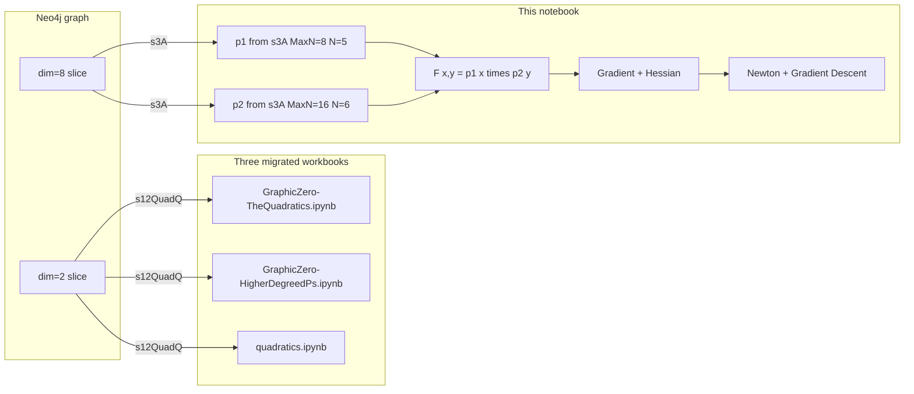
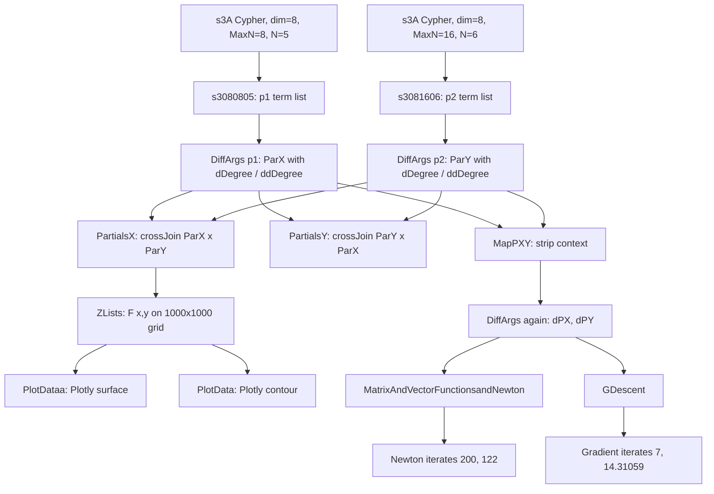

# MultiVariableNMGradientDescent — Companion Analysis

Companion document for the Zeppelin notebook export
[`MultiVariableNMGradientDescent (1).json`](MultiVariableNMGradientDescent%20%281%29.json)
(Zeppelin note name `GraphicMultiVarPDQuartetsForPlot 1`, id `2GXTHE9EN`).

This is a **cell-by-cell semantic breakdown** of the notebook and an explicit
tie-back to the three migrated parity workbooks in `ml/polys/workbook/`:

- [`ml/polys/workbook/GraphicZero-TheQuadratics.ipynb`](../polys/workbook/GraphicZero-TheQuadratics.ipynb)
- [`ml/polys/workbook/GraphicZero-HigherDegreedPs.ipynb`](../polys/workbook/GraphicZero-HigherDegreedPs.ipynb)
- [`ml/polys/workbook/quadratics.ipynb`](../polys/workbook/quadratics.ipynb)

---

## 1. What this notebook is, in one paragraph

The migrated workbooks establish that the Neo4j graph stores a **family of
reduced polynomials** `p_N(x)` whose evaluation at `x = MaxN` reproduces `2^N`.
They do that for **dimension `2`** (the "quadratics" slice) via
`DFScripts.s12QuadQ`.

This Zeppelin notebook does the same construction for **dimension `8`** (the
"quartet" slice) via `DFScripts.s3A`, then lifts a **pair** of those single-
variable reduced polynomials into a **separable bivariate function**
`F(x, y) = p1(x) · p2(y) / (div1 · div2)`. It then differentiates symbolically
to produce the gradient and Hessian, evaluates on a grid, plots, and runs
**Newton's descent** and **vanilla gradient descent** over that surface.

In short: the three migrated workbooks **prove the identity** that the graph
encodes; this notebook **uses** one of those identities (higher-dim version) as
an analytical object on which to run second-order optimization.

---

## 2. Relationship to the three migrated workbooks

| Concern | Quadratics / HigherDegreedPs / quadratics notebooks | This notebook |
|---------|----------------------------------------------------|---------------|
| Cypher reader | `DFScripts.s12QuadQ` | `DFScripts.s3A` |
| Dimension label | `Dimension = '2'` | `Dimension = '8'` |
| Query argument list | `(rangeLow, rangeHigh, index/nMax)` | `(rangeLow, rangeHigh, nMax, dimension)` |
| Returned shape | `(index, maxN, rowScalar, divisor, scalar, degree)` | `(degree, scalar, divisor, maxN, N)` (already **row-reduced**) |
| Equivalent intermediate | `ReducedMaxN8Range` (one row per `(MaxN, N, degree)`) | `s3080805`, `s3081606` (same structural meaning) |
| Number of variables | 1 (`x`) | 2 (`x`, `y`) via cross-join of two reduced polys |
| Final numeric claim | `p_N(MaxN) = 2^N` | Gradient descent / Newton on `F(x,y) = p1(x)·p2(y)` |
| Degree `-1` fold | `s12QuadQ` CASE: scalar ×2, degree →0 | `DiffArgs.differentiatedResult` CASE: `-1 → 0` |

Key insight: **`s3A`'s Cypher already performs the row-scalar reduction**
(the `apoc.number.exact.mul(RScalar, maxDivisor/rDivisor)` normalization and
the outer `REDUCE(sum='0', …)` accumulation) inside Neo4j. In the migrated
workbooks the same reduction is done in Python / Spark on the `s12QuadQ`
output (the `KvDegreeDS` / `ReducedMaxN8Range` stages). So the input to this
MultiVar notebook is the graph equivalent of **`ReducedMaxN8Range`** — just at
`Dimension = '8'` instead of `Dimension = '2'`.



---

## 3. Paragraph-by-paragraph walkthrough

Paragraph indices follow the order in the JSON's `"paragraphs"` array.

### Paragraph 0 — "Case Class Definitions."

All row and message shapes for the notebook. Highlights:

- `s3AQu(degree, scalar, divisior, MaxN, N, dimension)` — row shape returned
  by `DFScripts.s3A`. This is the same **(degree, scalar, divisor)** basis the
  migrated workbooks use in `ReducedMaxN8Range` / `ReducedMaxN8N7`, plus
  explicit `MaxN, N, dimension` columns.
- `s3AD(... , dDegree, dScalar)`,
  `s3ADD(... , dDegree, dScalar, ddDegree, ddScalar)` — first and second
  derivative columns stored inline with the original term.
- `pcTrms(deg1, sca1, div1, deg2, sca2, div2, nMax1, nMax2)`,
  `pcTrmsArgs(... , x, y)`, `pcTrmsArgsR(... , result)` — row shape **after
  cross-join** of two single-variable tables. This is the bivariate term
  representation.
- `graphArgsD(x, y, result)`, `nextXYD(x, y)`, `hess(a, b, c, d)` — plotting
  and Newton/Hessian message types (`Double`-typed for the optimizer side).

Matches the migrated notebooks' convention of keeping one frame per "row
shape", with `Decimal`/`BigDecimal` arithmetic for parity-sensitive math and
`Double` only for the numeric optimization hand-off.

### Paragraph 1 — "Query P() with D greater than two." (`QueryS3AQuery`)

Defines an `object QueryS3AQuery { def main(args) }` that:

1. Builds a Spark `ArrayBuffer[s3AQu]` by iterating
   `DFScripts.s3A(rLow, rHigh, nMax, dimension)`.
2. Converts it to a Spark `DataFrame` and `z.put(args(3), df)`.

CLI arg contract: `args(0)=dimension`, `args(1)=nMax`, `args(2)=N`,
`args(3)=dataframeName`. The s3A Cypher's own arguments (`rLow, rHigh, nMax,
dimension`) are wired via `s3AQuery(args(2), args(2), args(1), args(0))`, so
`rangeLow == rangeHigh == N` — a **single N** is extracted.

Tie-back: the **semantic role** of this cell is identical to the "extract /
load s12 table" cell in the three migrated workbooks. The only differences
are (a) it calls `s3A` (dim=8 Cypher with in-graph reduction) instead of
`s12QuadQ`, and (b) the returned rows are already reduced across `rowScalar`,
so no `KvDegreeDS` / `ReducedMaxN8Range` Spark step is needed.

### Paragraph 2 — `QueryS3AQuery` invocations

```scala
QueryS3AQuery.main(Array("8","8","5","s3080805"))
QueryS3AQuery.main(Array("8","16","6","s3081606"))
```

Reads:
- `z["s3080805"]` ← single-variable reduced polynomial `p1(x)` at
  **dim=8, MaxN=8, N=5**.
- `z["s3081606"]` ← single-variable reduced polynomial `p2(y)` at
  **dim=8, MaxN=16, N=6**.

These two frames are the **direct analogs of `ReducedMaxN8RangePivot`** rows
in `GraphicZero-HigherDegreedPs.ipynb`, only pulled directly from Neo4j via
the s3A Cypher rather than derived post-hoc in Python.

### Paragraphs 3–4 — Empty `%spark` placeholders

Unused paragraph slots (status `READY`, no code). Safe to treat as inert in
a port.

### Paragraph 5 — "Compute Partial Derivative DataFrames." (`DiffArgs`)

Defines `DiffArgs.differentiatedResult(q: s3AQu): s3ADD`.

Per row, applies the polynomial **power rule twice**:

- First derivative: `dDegree = degree - 1`, `dScalar = degree * scalar`.
- Second derivative: `ddDegree = dDegree - 1`, `ddScalar = dDegree * dScalar`.
- Sentinel: whenever a computed degree would be `-1`, it is replaced by `0`
  and its paired scalar is set to `0` (so the constant term vanishes under
  differentiation, which is algebraically correct).

`main(args)` reads two frames `p1DF` and `p2DF`, maps each row through
`differentiatedResult`, and also produces the **cross-joins**
`p1DFCG = p1DF2.crossJoin(p2DF2)` and `p2DFCG = p2DF2.crossJoin(p1DF2)`,
saving all four back to `z`:

- `z[args(2)] = ParX` — `p1` with derivatives (single-var)
- `z[args(3)] = ParY` — `p2` with derivatives (single-var)
- `z[args(4)] = PartialsX` — cross-joined pair (rows: term of p1 paired with
  every term of p2)
- `z[args(5)] = PartialsY` — reverse cross-join

Tie-back: the `-1 → 0` rule is the same algebraic discipline the migrated
workbooks apply via the `degree == -1` fold in `s12QuadQ` and its Python port
in `GraphicZero-HigherDegreedPs.ipynb`. Both places are **keeping the
polynomial basis integer-indexed** from `0` upward, not Laurent-indexed.

### Paragraph 6 — `DiffArgs` invocation

```scala
DiffArgs.main(Array("s3080805","s3081606","ParX","ParY","PartialsX","PartialsY"))
```

Produces the four `z` frames used by every downstream cell.

### Paragraph 7 — "Populate graph data lists." (`ZLists`)

Defines:

- `polyEvaluate(fPL: List[pcTrms])(xY: nextXYD): graphArgsD`

This is the **bivariate evaluator**. For each cross-joined term
`(deg1, sca1, div1, deg2, sca2, div2)` it computes:

```
res_i = (sca1 · x^deg1) · (sca2 · y^deg2) / (div1 · div2)
result = Σ_i res_i
```

i.e. it treats the cross-joined table as the coefficient list of the
separable bivariate polynomial

```
F(x, y) = (Σ_i a_i x^{p_i} / d1) · (Σ_j b_j y^{q_j} / d2)
       = Σ_{i,j} (a_i · b_j) / (d1·d2) · x^{p_i} · y^{q_j}
```

which is the algebraic identity behind the cross-join: **the Cartesian product
of two univariate polynomial term lists is the term list of their product**.

`main(args)` then builds a 1000×1000 grid. It parameterizes as
`x_step = 2.0`, `x_start = -1000.0 + x·2.0`, same for y (so the grid spans
roughly `(-1000, 1000)` on both axes). For each grid point it evaluates F and
stores `List[List[Double]]` into `z[args(1)]` (`GraphArgs`) and axis labels
into `z[args(2)]` (`GraphAxis`).

Tie-back: this is the **same `(scalar · x^degree) / divisor` evaluation** that
`rUdfMaxN8` computes row-wise in the migrated notebooks
(`extend_result_row`), generalized to two variables via cross-join.

### Paragraph 8 — `ZLists` invocation

```scala
ZLists.main(Array("PartialsX","GraphArgs","GraphAxis"))
```

Note: it feeds `PartialsX` (the cross-join). The single-variable derivative
columns are **present** in that frame but **not selected** by the column
indices in `polyEvaluate` — `row.getString(0)` and `row.getString(1)` pick the
**original** `degree` and `scalar` for p1, and `row.getString(10)` and
`row.getString(11)` pick the **original** p2 columns in the joined schema.
So `GraphArgs` holds `F(x, y)` itself (zeroth-order), not its derivatives.

### Paragraphs 9–12 — Plot objects and invocations

- `PlotDataa` — emits a Plotly **`surface`** plot of `termsL` against
  `axisT`/`axisT`.
- `PlotData` — same structure, emits a Plotly **`contour`** plot.
- Each has a trivial `main(args)` that reads `z[args(0)]` (values) and
  `z[args(1)]` (axis labels) and prints inline `%html` with a `<script>` that
  calls `Plotly.newPlot`.

Invocations:

```scala
PlotDataa.main(Array("GraphArgs","GraphAxis"))   // surface
PlotData .main(Array("GraphArgs","GraphAxis"))   // contour
```

There is no direct analog in the three migrated workbooks (they produce
numeric parity tables, not plots). If porting this notebook, replace with
`plotly.graph_objects.Figure(go.Surface(...))` / `go.Contour(...)` in Python.

### Paragraphs 13–14 — `MapPXY` and invocation

Defines an object that reads `Dataset[s3ADD]` frames (`ParX`, `ParY`) and
projects each row into an `s3AQu` shape where the `degree, scalar, divisor`
fields carry the **original polynomial term** (not the `dDegree/ddScalar`
columns), and `MaxN, N, dimension` are zeroed out:

```scala
val fA = p1DF.map(r => s3AQu(r.degree, r.scalar, r.divisior, "0","0","0"))
val fB = p2DF.map(r => s3AQu(r.degree, r.scalar, r.divisior, "0","0","0"))
z.put(args(2), fA)   // PX
z.put(args(3), fB)   // PY
```

Invoked as:

```scala
MapPXY.main(Array("ParX","ParY","PX","PY"))
```

Semantics: `PX` is `p1`'s term list **stripped of context** (grid / index
columns cleared to `"0"`), ready to be re-fed into `DiffArgs` as if it were a
fresh extract. This is an intentional hack so the next cell can produce
`dPX` / `dPY` **cross-joined derivatives** of the already-derived polynomials
without modifying `DiffArgs`.

### Paragraph 15 — Chained `DiffArgs` invocation

```scala
DiffArgs.main(Array("PX","PY","rX","rY","dPX","dPY"))
```

Writes:
- `z["rX"]` — first/second derivatives of `p1` (unused downstream).
- `z["rY"]` — first/second derivatives of `p2` (unused downstream).
- `z["dPX"]` — cross-join `p1_with_derivs × p2_with_derivs`. **Every** row
  has twenty-something columns: `p1`'s `(degree, scalar, divisor, MaxN, N,
  dimension, dDegree, dScalar, ddDegree, ddScalar)` followed by `p2`'s same
  ten columns. This is the **primary input for Newton's descent**.
- `z["dPY"]` — the reverse cross-join.

The embedded console output in the JSON (paragraph 15's `"msg"`) shows the
concrete coefficients for a specific run. The `p1` term list (5 terms, quartic)
is

```
degree  scalar    divisor
4       6         4
3       -168      4
2       1786      4
1       -8508     4
0       15328     4
```

i.e. `p1(x) = (6 x^4 − 168 x^3 + 1786 x^2 − 8508 x + 15328) / 4`, and `p2` is

```
degree  scalar    divisor
4       14        4
3       -830      4
2       18492     4
1       -183448   4
0       683648    4
```

i.e. `p2(y) = (14 y^4 − 830 y^3 + 18492 y^2 − 183448 y + 683648) / 4`.

These are **quartic single-variable polynomials**, consistent with this being
the "MultiVarPDQuartets" notebook. (The "quartet" in the notebook title
refers to `dim=8`, which in the two-polynomial construction produces
four-term-per-scalar quartics.)

### Paragraphs 16–18 — Empty `%spark` slots

Unused — same inert status as paragraphs 3–4.

### Paragraph 19 — "Newton's Descent" (`MatrixAndVectorFunctionsandNewton`)

The core object. Key methods:

- `polyEvaluate(fPL: List[pcTrms])(xY: nextXYD): graphArgsD` — identical to
  the bivariate evaluator in `ZLists`.
- `evalGradient(xF, yF)(xY) => nextXYD(xF(xY).result, yF(xY).result)` —
  gradient at a point.
- `evalHessian(aF, bF, cF, dF)(xY) => hess(...)` — the 2×2 **inverse**
  Hessian in one step:
  ```
  det = 1 / (a·d − b·c)
  H^{-1} = [[ d·det, -b·det ],
            [-c·det,  a·det ]]
  ```
  (Returns the adjugate-divided-by-determinant form directly.)
- `evalHessian1(...)` — same interface, returns the plain 2×2 Hessian (for
  debugging — `"not production method"` per the inline comment).
- `steepestDescent(x, learningRate, tolerance, cHess, cFun)` — Newton's
  step: `x_{k+1} = x_k − H^{-1}(x_k) · ∇f(x_k)` for 10000 iterations.

`main(args)` then **column-index-muxes** `dPX` (the quartic cross-join table)
to build the four derivative term lists Newton needs:

| Role              | p1 columns | p2 columns | Role in F(x,y)          |
|-------------------|------------|------------|-------------------------|
| `fEval`           | 0,1,2      | 10,11,12   | F itself                |
| `fOfdX` (∂F/∂x)   | 6,7,2      | 10,11,12   | d/dx of p1 · p2         |
| `fOfdY` (∂F/∂y)   | 0,1,2      | 16,17,12   | p1 · d/dy of p2         |
| `fA`  (∂²F/∂x²)   | 8,9,2      | 10,11,12   | d²/dx² of p1 · p2       |
| `fB`  (∂²F/∂x∂y)  | 6,7,2      | 16,17,12   | d/dx of p1 · d/dy of p2 |
| `fC`  (∂²F/∂y∂x)  | 6,7,2      | 16,17,12   | same as fB (symmetric)  |
| `fD`  (∂²F/∂y²)   | 0,1,2      | 18,19,12   | p1 · d²/dy² of p2       |

Columns `0..9` are `p1`'s ten columns (`s3ADD` fields), columns `10..19` are
`p2`'s same ten fields, offset by ten because of the cross-join. Indices `6,7`
pick `dDegree, dScalar`; indices `8,9` pick `ddDegree, ddScalar`.

Starts at `nextXYD(200, 122)` with `learningRate=0.05`, `tolerance=1e-7`, and
prints `xVectorNextIterate` each iteration. Newton's step uses the already-
inverted Hessian so the update is a plain matrix multiply.

Tie-back: in `GraphicZero-TheQuadratics.ipynb`, the per-row quadratic roots
in `Rootsmaxn8n7` are computed analytically via the quadratic formula (closed
form). Here, the bivariate **critical points** have no closed form in general,
so Newton's method is used — but the **underlying coefficient basis** is the
same `(scalar, divisor, degree)` triple the migrated notebooks already work
with. Symbolic differentiation via `DiffArgs` is the higher-dim analog of the
power-rule-by-hand the migrated notebooks use when evaluating `MaxN^degree`.

### Paragraph 20 — Newton invocation

```scala
MatrixAndVectorFunctionsandNewton.main(Array("dPX","dPY"))
```

Runs Newton from `(200, 122)` for 10000 iterations. (`dPY` arg is present but
not actually read by `main` — only `args(0)` / `dPX` is used.)

### Paragraphs 21–22 — Empty `%spark` slots

Unused.

### Paragraph 23 — "Gradient Descent" (`GDescent`)

Structurally identical to `MatrixAndVectorFunctionsandNewton` but the
`steepestDescent` body is stripped of Hessian logic. Update rule:

```
x_{k+1} = x_k − learningRate · ∇f(x_k)
```

with `learningRate = 1e-9`, starting at `nextXYD(7.0, 14.31059)`, for 110000
iterations. Produces the `GDescent` object.

Why a much smaller learning rate and a different start? Gradient descent on a
quartic surface with coefficients in the thousands is numerically stiff; the
tiny step size is an empirical stabilization, and `(7, 14.31059)` is near a
known basin rather than the arbitrary `(200, 122)` used by Newton (which has
much better scale-invariance because of the Hessian).

### Paragraph 24 — Gradient Descent invocation

```scala
GDescent.main(Array("dPX","dPY"))
```

The JSON shows this cell in `ERROR` state at export time
(`MissingRequirementError: object java.lang.Object`). That is a **Spark/Scala
interpreter re-init error**, not a logic error — it appears when the Spark
shell lost its classloader between runs. The source itself compiles and runs
when executed in sequence after paragraph 23.

### Paragraphs 25–26 — Trailing empty slots

Unused.

---

## 4. How the pieces fit together



Three parallel purposes are fulfilled by the same symbolic term list `(dPX)`:

1. **Visualization** (surface + contour) — reveals topology of `F(x, y)`.
2. **Second-order optimization** (Newton) — converges in few iterations but
   needs correct inverse Hessian.
3. **First-order optimization** (Gradient Descent) — robust baseline.

---

## 5. Why this matters for the migrated workbooks

The three migrated workbooks close the **numeric identity loop** for a single
fixed dimension (2). They demonstrate:

> The graph-stored polynomial evaluates to its declared `Evaluate.Value = 2^N`
> when reconstructed from `(scalar, divisor, rowScalar, degree, MaxN)` alone.

The MultiVar notebook shows **what that identity is good for once established**:

- With the reduced polynomial in hand, you can treat it as a first-class
  analytical function — differentiate, cross-multiply, evaluate, visualize,
  optimize.
- Every arithmetic rule the MultiVar notebook relies on (power rule with the
  `-1 → 0` sentinel, integer-coefficient arithmetic, explicit divisor tracking,
  Spark Dataset projections from the graph) is already implemented and tested
  in the migrated workbooks' reduced path. Porting this notebook to Python
  would reuse `extend_result_row`-shaped helpers and a `DiffArgs`-shaped
  symbolic differentiator bolted onto the same schemas.
- The three workbooks validate the **(dim = 2, single-variable)** slice. The
  MultiVar notebook is the template for validating and using **higher-dim,
  multivariable** slices. A future Python migration of it would:
  - reuse the `z: dict[str, pd.DataFrame]` checkpoint convention,
  - replace `DFScripts.s3A` with a Python Bolt adapter analogous to
    `load_s12_quadq_live` in `GraphicZero-HigherDegreedPs.ipynb`,
  - add a `Decimal`-based `diff_args` helper with the same `-1 → 0` rule,
  - optionally lift the plotting cells to `plotly.graph_objects`,
  - keep Newton/GD in `numpy` (2×2 Hessian inverse in closed form is trivial).

---

## 6. Known gotchas if porting

- **Cross-join column indices are hard-coded.** Cells like paragraph 19 refer
  to columns `0..19` by integer index after `crossJoin`. In a Python port,
  project the DataFrame to named columns (`p1_deg`, `p1_scalar`, ...,
  `p2_ddDegree`, `p2_ddScalar`) before building term lists.
- **`MapPXY` zeroes `(MaxN, N, dimension)` columns** so a second pass of
  `DiffArgs` can operate without context. This is a side effect of reusing
  `s3AQu` as a generic (degree, scalar, divisor) carrier; a Python port should
  either keep context columns and ignore them, or use a cleaner term class.
- **`evalHessian` returns the already-inverted Hessian.** When wiring new
  optimizers, do not call `inv(hess)` on top of it.
- **The `-1 → 0` rule in `DiffArgs`** is the same fold applied by `s12QuadQ`
  on the Cypher side. Keep both in sync if you port either.
- **Paragraph 24 error in the JSON** is an interpreter re-init artifact;
  ignore it when translating logic.

---

## 7. Recommended location for a future Python port

If / when this notebook is migrated (following the pattern already used for
the three workbooks), a good location is:

```
ml/polys/workbook/GraphicMultiVarPDQuartetsForPlot.ipynb
```

with a companion entry in [`ml/polys/README.md`](../polys/README.md) next to
the existing legacy-parity notebook list, and a short "Higher-dimension path"
subsection appended to
[`ml/polys/GraphStructureToResultPoly.md`](../polys/GraphStructureToResultPoly.md)
referencing back here for the dim = 8 s3A Cypher semantics.
