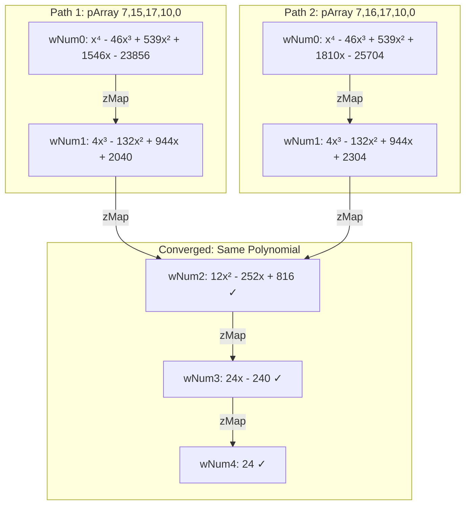

# Reference: Examples, Verification, and Glossary

This document provides worked examples, algorithm verification, and a consolidated glossary for the formal documentation set.

---

## Part 1: Worked Examples

### 1.1 Difference Table for P(x) = x⁴

```
k:      0    1     2     3      4      5
P(k):   0    1    16    81    256    625

Δ¹P:       1    15    65    175    369
Δ²P:          14    50    110    194
Δ³P:             36    60     84
Δ⁴P:                24    24         ← constant = 4! = 24 ✓
```

**Values at k=0:**
- Δ⁰P(0) = 0
- Δ¹P(0) = 1
- Δ²P(0) = 14
- Δ³P(0) = 36
- Δ⁴P(0) = 24

### 1.2 Zeroing Out Δ³P(0)

**Goal:** Modify P(x) so that Δ³P(0) = 0

**Principle:** To affect Δ³P, we need a **cubic** term because:
- Δ³(linear) = 0
- Δ³(quadratic) = 0  
- Δ³(cubic) = 3! = 6 (constant)

**Calculation:**
```
Δ³(x⁴)(0) = 36
Δ³(x³) = 6 (constant)

To zero: 36 - 6c = 0  →  c = 6
```

**Solution:** P(x) = x⁴ - 6x³

**Verification:**
```
P(x) = x⁴ - 6x³

k:      0    1     2     3      4
P(k):   0   -5   -32   -81   -128

Δ¹P:      -5   -27   -49    -47
Δ²P:         -22   -22      2
Δ³P:             0    24        ← NOW ZERO AT k=0! ✓
Δ⁴P:               24
```

### 1.3 Zeroing Out Δ²P(0)

**Goal:** Modify P(x) so that Δ²P(0) = 0

**Calculation:**
```
Δ²(x⁴)(0) = 14
Δ²(x²) = 2 (constant)

To zero: 14 - 2c = 0  →  c = 7
```

**Solution:** P(x) = x⁴ - 7x²

**Verification:**
```
x⁴ - 7x²: 0, -6, -12, 18, 144, 450
Δ¹(x⁴ - 7x²): -6, -6, 30, 126, 306
Δ²(x⁴ - 7x²): 0, 36, 96, 180

Δ²(x⁴ - 7x²)(0) = 0 ✓
```

### 1.4 Consecutive Integer Roots

For P(x) = x(x-1)(x-2)(x-3) = x⁴ - 6x³ + 11x² - 6x:

```
k:      0    1    2    3     4
P(k):   0    0    0    0    24

Δ¹P:       0    0    0    24
Δ²P:          0    0    24
Δ³P:            0    24
Δ⁴P:              24
```

**All zeros in column k=0!** This is because consecutive roots {0, 1, 2, 3} cause zeros to propagate:
- P(0) = 0 → P(1) = 0 → Δ¹P(0) = P(1) - P(0) = 0
- P(1) = 0 → P(2) = 0 → Δ¹P(1) = 0 → Δ²P(0) = 0
- And so on...

### 1.5 Graph Convergence Example

Two different pArray signatures can **converge** to the same Dnode at lower difference levels. This example from a graph with `dimension=4, integerRange=200`:



**Polynomial Details at Each Node:**

| Dnode | wNum | Polynomial P(x) | muList | rootList | d | determined |
|-------|------|-----------------|--------|----------|---|------------|
| 1131211 | 0 | x⁴ - 46x³ + 539x² + 1546x - 23856 | [7] | [7] | 7 | 0 |
| 1131342 | 0 | x⁴ - 46x³ + 539x² + 1810x - 25704 | [7] | [7] | 7 | 0 |
| 1131165 | 1 | 4x³ - 132x² + 944x + 2040 | [15] | [15] | 15 | 0 |
| 1131296 | 1 | 4x³ - 132x² + 944x + 2304 | [16] | [16] | 16 | 0 |
| **1129239** | 2 | **12x² - 252x + 816** | [4,16] | [4,17] | 20 | **1** |
| **1118395** | 3 | **24x - 240** | [10] | [10] | 10 | **1** |
| **9** | 4 | **24** (constant) | [] | — | 0 | **1** |

**Convergence Summary:**

| wNum | Degree | Path 1 Dnode | Path 2 Dnode | Same? | determined |
|------|--------|--------------|--------------|-------|------------|
| 0 | 4 | 1131211 | 1131342 | No | 0 |
| 1 | 3 | 1131165 | 1131296 | No | 0 |
| 2 | 2 | **1129239** | **1129239** | **Yes** | 1 |
| 3 | 1 | **1118395** | **1118395** | **Yes** | 1 |
| 4 | 0 | **9** | **9** | **Yes** | 1 |

**Why Convergence Occurs:**
- At wNum=2, both paths produce the same quadratic polynomial: 12x² - 252x + 816
- The difference in wNum=1 roots (15 vs 16) "cancels out" in the second difference
- Lower levels share identical polynomial coefficients (vmResult)

**Property Clarification:**
- `d=20` at wNum=2 means μ denominator = 4 + 16 = 20 (NOT polynomial degree)
- Polynomial degree = dimension - wNum = 4 - 2 = 2 (quadratic at wNum=2)
- determined=1 because totalZero=2 equals polynomial degree=2

---

## Part 2: Graph Export Format

### 2.1 Structure of graphsample.json

The JSON contains Cypher path objects:

```json
{
  "p": {
    "start": { /* source Dnode */ },
    "end": { /* target Dnode */ },
    "segments": [
      {
        "start": { /* Dnode */ },
        "relationship": { "type": "zMap", ... },
        "end": { /* Dnode */ }
      }
    ],
    "length": 1.0
  }
}
```

### 2.2 Example Node Properties

**Empty Root Set (Undetermined):**
```json
{
  "vmResult": "[0.0, 3.9999999999999996, 6.0, 4.0, 1.0]",
  "muList": "[]",
  "d": 0,
  "n": 0,
  "totalZero": 0,
  "determined": 0
}
```

Interpretation: P(x) ≈ (x+1)⁴, no integer roots detected.

**Single Root (Determined):**
```json
{
  "vmResult": "[0.0, 24.0, -24.0]",
  "muList": "[1]",
  "d": 1,
  "n": 1,
  "totalZero": 1,
  "determined": 1,
  "rootList": [1]
}
```

Interpretation: P(x) = -24x(x-1), root at x=1, determined.

### 2.3 Coefficient Interpretation

> **Source:** Coefficient ordering is determined by `MatrixA.java:transcribePowers()` which builds the Vandermonde matrix with **descending powers**.

```
vmResult = [aₙ, aₙ₋₁, ..., a₁, a₀]   (DESCENDING powers)

P(x) = aₙxⁿ + aₙ₋₁xⁿ⁻¹ + ... + a₁x + a₀
```

| vmResult | Polynomial | Degree | Roots |
|----------|------------|--------|-------|
| `[0.0, 24.0]` | 24 (constant) | 0 | none |
| `[0.0, 24.0, -240.0]` | 24x - 240 = 24(x-10) | 1 | x = 10 |
| `[0.0, 12.0, -252.0, 816.0]` | 12x² - 252x + 816 | 2 | x = 4, 17 |

**Note:** The leading coefficient aₙ is often 0, meaning the effective degree is less than the array length minus 1. Floating-point precision artifacts appear (e.g., `3.9999999999999996` instead of `4.0`) due to Vandermonde matrix numerical solutions.

---

## Part 3: Binary Encoding Examples

### 3.1 muList to Integer

```
muList = [i₀, i₁, ...]  →  Set bit positions  →  Binary  →  Integer

Examples:
  muList = []      → no bits set   → "0"     → 0
  muList = [0]     → bit 0 set     → "1"     → 1
  muList = [1]     → bit 1 set     → "10"    → 2
  muList = [0,1]   → bits 0,1 set  → "11"    → 3
  muList = [2]     → bit 2 set     → "100"   → 4
  muList = [0,2]   → bits 0,2 set  → "101"   → 5
  muList = [1,2]   → bits 1,2 set  → "110"   → 6
  muList = [0,1,2] → bits 0,1,2    → "111"   → 7
```

### 3.2 Integer to Set Collection (Decoder)

Given binary string `10101` (positions 0, 2, 4 have value 1):

```
i=0: 0 = n + |Aₙ| - 1  →  n=0, |A₀|=1  →  A₀ = {1}
i=2: 2 = n + |Aₙ| - 1  →  n=1, |A₁|=2  →  A₁ = {1,2}
i=4: 4 = n + |Aₙ| - 1  →  n=2, |A₂|=3  →  A₂ = {1,2,3}

D(10101) = {{1}, {1,2}, {1,2,3}}
```

### 3.3 Set Union Ratio (μ) Calculation

For Å = {{1}, {1,2}, {1,2,3}}:

```
|∪ A| = |{1,2,3}| = 3  (union cardinality)
Σ|A| = 1 + 2 + 3 = 6   (sum of sizes)

μ(Å) = 3/6 = 1/2
```

---

## Part 4: Key Variable Mappings

### 4.1 Math Concept to Code

| Math Concept | Java Variable | Neo4j Property |
|--------------|---------------|----------------|
| P(x) coefficients | `pArray` (evaluation) | — |
| Polynomial identity | — | `vmResult` on Dnode |
| Zero-position signature | — | `pArray` on CreatedBy |
| Degree n | `dimension` | `d` on Dnode |
| Evaluation range | `integerRange` | — |
| Ψᵢ (level i values) | `LoopList` at `wNum=i` | — |
| Zero positions | `muList` | `muList` on Dnode |
| True root positions | — | `rootList` on Dnode |
| Zero count | `totalZero` | `totalZero` on Dnode |
| Difference level | `wNum` | `wNum` on CreatedBy |
| Classification | — | `determined` on Dnode |

### 4.2 Difference Level Mapping

```
wNum = 0  →  d = dimension    (source polynomial)
wNum = 1  →  d = dimension-1  (1st difference)
wNum = 2  →  d = dimension-2  (2nd difference)
...
wNum = dimension  →  d = 0    (constant)
```

---

## Part 5: Glossary

### Core Terminology

| Term | Definition |
|------|------------|
| **Δ (Delta)** | Forward difference operator: Δf(k) = f(k+1) - f(k) |
| **Ψᵢ (Psi)** | Polynomial at difference level i |
| **TriagTriag** | Triangle of Triangles — tabular representation of iterated differences |
| **DOSPT** | Difference of Scalars Polynomial Tree — hierarchical factorial structure |
| **SDP** | Scalar Difference Polynomial — factorial scalar patterns |
| **μ (mu)** | Set Union Ratio: μ(Å) = \|∪A\| / Σ\|A\| → maps to rationals |
| **χ (chi)** | Binary Encoding Rule → maps to integers |

### Graph Properties

| Property | Definition |
|----------|------------|
| **vmResult** | Polynomial coefficients [a₀, a₁, ...] from Vandermonde solution |
| **muList** | Adjusted root positions (indices where polynomial = 0) |
| **rootList** | True mathematical x-positions where polynomial equals zero |
| **n** | Numerator of μ rational (max of muList values) |
| **d** | Denominator of μ rational (= Σ muList values). **NOT polynomial degree** |
| **totalZero** | Count of integer roots found within evaluation range |
| **determined** | 1 if totalZero == (dimension - wNum), 0 otherwise |
| **wNum** | Worker number / difference level index |

> **Critical:** Polynomial degree = `dimension - wNum`, which is NOT stored directly. The `d` property is the μ denominator for bijection mapping.

### Algorithm Components

| Component | Definition |
|-----------|------------|
| **pArray** | On CreatedBy: zero-position signature [r₀, r₁, ...]. In Java: polynomial coefficients |
| **figPArray** | Mutable coefficient array adjusted during construction |
| **moduloList** | Factorial lookup table [1, 1!, 2!, 3!, ...] |
| **computeIndexZero** | Method that adjusts coefficients to force zeros at specified positions |
| **caiIndex** | Cumulative Adjustment Index — internal counter affecting muList values |
| **Latent root** | Zero discovered by algorithm but not specified in pArray signature |

### Classification Terms

| Term | Definition |
|------|------------|
| **Determined** | Polynomial with all expected roots found: totalZero == (dimension - wNum) |
| **Undetermined** | Polynomial with fewer roots than expected: totalZero < (dimension - wNum) |
| **Positive definite** | Polynomial P(x) > 0 for all real x (no real roots) |
| **Out of range** | Integer root exists but outside evaluation window |

---

## Part 6: Cypher Query Reference

### Basic Queries

**Count nodes by classification:**
```cypher
MATCH (n:Dnode)
RETURN n.determined AS status, COUNT(n) AS count
```

**Get polynomials at specific depth:**
```cypher
MATCH (p:Dnode {d: 2})
RETURN p.vmResult, p.muList, p.determined
```

**Traverse difference chain:**
```cypher
MATCH path = (root:Dnode)-[:zMap*]->(leaf:Dnode)
WHERE NOT (leaf)-[:zMap]->()
RETURN path
LIMIT 10
```

### Analysis Queries

**Count by μ denominator:**
```cypher
MATCH (p:Dnode)
RETURN p.d AS muDenominator, COUNT(p) AS nodeCount
ORDER BY p.d DESC
```

**Find convergence points:**
```cypher
MATCH (child:Dnode)<-[r:zMap]-()
WITH child, COUNT(r) AS incomingCount
WHERE incomingCount > 1
RETURN child.vmResult, child.d AS muDenom, incomingCount
ORDER BY incomingCount DESC
```

**Verify completeness (determined nodes by muList):**
```cypher
MATCH (n:Dnode {determined: 1})
RETURN COUNT(DISTINCT n.muList) AS distinct_patterns
```

---

## Part 7: Configuration Reference

### Generation Parameters

| Parameter | Typical Value | Effect |
|-----------|---------------|--------|
| `dimension` | 5 | Tree depth = dimension + 1 levels |
| `integerRange` | 200 | Evaluation: k ∈ [-100, +99] |
| `setProductRange` | 4 | Up to 4^5 = 1024 source polynomials |

### Software Requirements

| Component | Version | Purpose |
|-----------|---------|---------|
| Neo4j | 4.x+ | Graph database |
| GDS Library | 1.6+ | Graph algorithms |
| Apache Zeppelin | — | ML notebooks |
| Java | — | ZerosAndDifferences.jar |

### Key GDS Procedures

```cypher
-- Graph Management
gds.graph.create()
gds.graph.drop()

-- Embeddings
gds.beta.graphSage.train()
gds.beta.graphSage.mutate()

-- Classification
gds.alpha.ml.nodeClassification.train()
gds.alpha.ml.nodeClassification.predict.write()

-- Link Prediction
gds.alpha.ml.linkPrediction.train()
gds.alpha.ml.linkPrediction.predict.stream()
```

---

## Part 8: Cross-Reference Index

### Key Concepts → Documents

| Concept | Primary Document |
|---------|------------------|
| Newton's differences | [02_theory](02_theory.md) Part I |
| Set Union Ratio (μ) | [02_theory](02_theory.md) Part III |
| Binary Encoding (χ) | [02_theory](02_theory.md) Part III |
| Algorithm construction | [03_implementation](03_implementation.md) Parts 1-5 |
| Graph schema | [03_implementation](03_implementation.md) Part 6 |
| Determined/Undetermined | [04_classification](04_classification.md) |
| ML tasks | [05_machine_learning](05_machine_learning.md) |
| Power set correspondence | [02_theory](02_theory.md) Part IV |
| Diophantine connection | [02_theory](02_theory.md) Part II |

### Node Properties → Documents

| Property | Defined In | Explained In |
|----------|------------|--------------|
| `vmResult` | [03_implementation](03_implementation.md) | This reference |
| `muList` | [03_implementation](03_implementation.md) | [02_theory](02_theory.md) |
| `n`, `d` | [03_implementation](03_implementation.md) | [02_theory](02_theory.md) |
| `determined` | [03_implementation](03_implementation.md) | [04_classification](04_classification.md) |
| `totalZero` | [03_implementation](03_implementation.md) | [04_classification](04_classification.md) |

---

## References

### Primary Sources

- Newton, I. — *Methodus Differentialis*
- Cantor, G. — Countability proofs
- `html-with-appendix-and-toc.html` — Bijection theory
- `A Set-Theoretic Approach...pdf` — Formal paper

### Related Literature

- Graham, Knuth, Patashnik — *Concrete Mathematics*
- Mordell — *Diophantine Equations*
- Halmos — *Naive Set Theory*

---

*This document consolidates content from `math_verification.md`, `the_graph.md`, and glossaries from multiple sources.*

