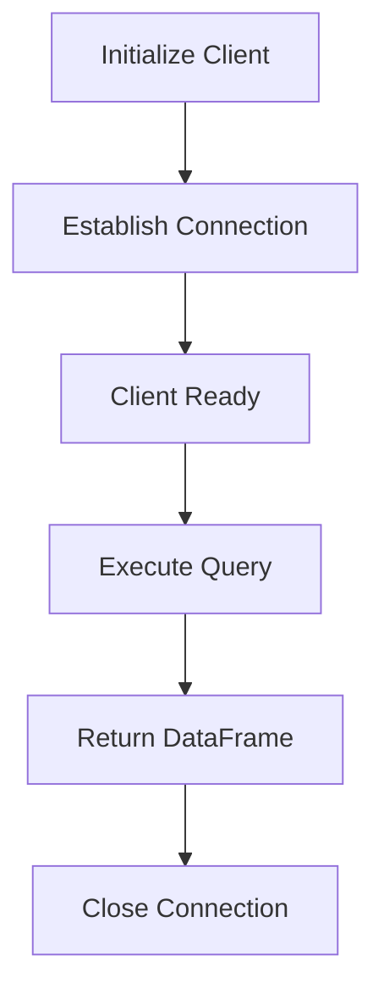

# Neo4j Client - Simple Database Connector

A minimal, single-responsibility Python client for Neo4j graph database that provides a clean interface for executing Cypher queries and retrieving results as pandas DataFrames.

## Features

- **Simple Connection Management**: Easy initialization with URI, username, and password
- **Query Execution**: Execute any Cypher query with optional parameters
- **DataFrame Integration**: Automatic conversion of query results to pandas DataFrames
- **Error Handling**: Robust exception handling for connection and query errors
- **Summary Information**: Execution statistics for non-returning queries (CREATE, DELETE, etc.)

## Architecture



## Installation

Install required dependencies:

```bash
pip install neo4j pandas
```

## Quick Start

```python
from ml.neo4j.neo4jClient import Neo4jClient

# Initialize client
client = Neo4jClient(
    uri="bolt://localhost:7687",
    user="neo4j",
    password="your_password"
)

try:
    # Execute a query
    df = client.run_query(
        "MATCH (n:Person) RETURN n.name, n.age LIMIT 10",
        database="neo4j"
    )
    print(df)
finally:
    # Always close the connection
    client.close()
```

## Usage

### Basic Import and Connection

**In Python Scripts (`.py`):**

```python
from ml.neo4j.neo4jClient import Neo4jClient

# Initialize client
client = Neo4jClient(
    uri="bolt://localhost:7687",
    user="neo4j",
    password="password"
)

try:
    # Use the client
    results = client.run_query("MATCH (n) RETURN n LIMIT 10", "neo4j")
    print(results)
finally:
    # Always close the connection
    client.close()
```

**In Jupyter Notebooks (`.ipynb`):**

```python
# Cell 1: Import and initialize
from ml.neo4j.neo4jClient import Neo4jClient

client = Neo4jClient(
    uri="bolt://localhost:7687",
    user="neo4j",
    password="password"
)

# Cell 2: Run queries
df = client.run_query("MATCH (n) RETURN n LIMIT 10", "neo4j")
df.head()

# Cell 3: More queries
# ...

# Cell N: Cleanup
client.close()
```

### Simple Query Execution

```python
# Basic query without parameters
query = """
MATCH (n:Person)
RETURN n.name AS name, n.age AS age
ORDER BY n.age DESC
LIMIT 10
"""

df = client.run_query(query, "neo4j")
print(df)
```

### Parameterized Queries

Use parameters for security and flexibility:

```python
# Query with parameters
query = """
MATCH (p:Person)-[:KNOWS]->(friend)
WHERE p.name = $person_name
RETURN friend.name AS friend_name, friend.age AS age
"""

parameters = {"person_name": "Alice"}
df = client.run_query(query, "neo4j", parameters)
print(df)
```

### DataFrame Output

The client automatically converts query results to pandas DataFrames:

```python
# Query returns records as DataFrame
df = client.run_query("MATCH (n:Person) RETURN n.name, n.age", "neo4j")

# Access data like any pandas DataFrame
print(df.head())
print(df.describe())
print(df['n.name'].unique())

# Data manipulation
filtered = df[df['n.age'] > 25]
print(filtered)
```

### Summary Information

For queries that don't return records (CREATE, DELETE, etc.), the client provides execution statistics:

```python
# Create nodes
query = "CREATE (p:Person {name: $name, age: $age})"
parameters = {"name": "Bob", "age": 30}

df = client.run_query(query, "neo4j", parameters)
print(df)

# Output:
#    nodes_created  relationships_created  properties_set  result_available_after  result_consumed_after
# 0              1                      0               2                      15                     20
```

## API Reference

### `Neo4jClient`

Main client class for Neo4j database interactions.

---

#### `__init__(uri: str, user: str, password: str)`

Initialize the Neo4j client and establish a connection.

**Parameters:**
- `uri` (str): Neo4j connection URI (e.g., `bolt://localhost:7687`)
- `user` (str): Database username
- `password` (str): Database password

**Raises:**
- `ConnectionError`: If connection to Neo4j fails

**Example:**
```python
client = Neo4jClient("bolt://localhost:7687", "neo4j", "password")
```

---

#### `run_query(query: str, database: str, parameters: dict = None) -> pd.DataFrame`

Execute a Cypher query and return results as a pandas DataFrame.

**Parameters:**
- `query` (str): Cypher query string to execute
- `database` (str): Target database name
- `parameters` (dict, optional): Query parameters for parameterized queries

**Returns:**
- `pd.DataFrame`: Query results or execution summary

**Raises:**
- `RuntimeError`: If query execution fails

**Example:**
```python
# Simple query
df = client.run_query("MATCH (n) RETURN n LIMIT 5", "neo4j")

# Parameterized query
df = client.run_query(
    "MATCH (p:Person {name: $name}) RETURN p",
    "neo4j",
    {"name": "Alice"}
)
```

---

#### `close() -> None`

Close the Neo4j driver connection.

**Example:**
```python
client.close()
```

---

## Common Query Patterns

### Node Creation

```python
# Create single node
query = "CREATE (n:Person {name: $name, age: $age})"
client.run_query(query, "neo4j", {"name": "Alice", "age": 30})

# Create multiple nodes with relationships
query = """
CREATE (a:Person {name: 'Alice'})
CREATE (b:Person {name: 'Bob'})
CREATE (a)-[:KNOWS]->(b)
"""
client.run_query(query, "neo4j")
```

### Relationship Queries

```python
# Find all relationships
query = """
MATCH (a)-[r]->(b)
RETURN a, type(r) AS relationship, b
LIMIT 100
"""
df = client.run_query(query, "neo4j")

# Find specific relationship patterns
query = """
MATCH (p:Person)-[:WORKS_AT]->(c:Company)
WHERE c.name = $company_name
RETURN p.name AS employee, p.role AS role
"""
df = client.run_query(query, "neo4j", {"company_name": "Acme Corp"})
```

### Aggregations

```python
# Count by group
query = """
MATCH (n:Person)
RETURN n.department AS department, 
       count(*) AS employee_count,
       avg(n.age) AS avg_age
"""
df = client.run_query(query, "neo4j")

# Statistical summaries
query = """
MATCH (p:Product)
RETURN min(p.price) AS min_price,
       max(p.price) AS max_price,
       avg(p.price) AS avg_price,
       sum(p.stock) AS total_stock
"""
df = client.run_query(query, "neo4j")
```

### Path Finding

```python
# Shortest path
query = """
MATCH path = shortestPath(
  (a:Person {name: $start})-[*]-(b:Person {name: $end})
)
RETURN [node IN nodes(path) | node.name] AS path,
       length(path) AS path_length
"""
params = {"start": "Alice", "end": "Bob"}
df = client.run_query(query, "neo4j", params)

# All paths with constraints
query = """
MATCH path = (a:Person {name: $start})-[:KNOWS*1..3]-(b:Person)
RETURN DISTINCT b.name AS connected_person,
       length(path) AS degrees_of_separation
ORDER BY degrees_of_separation
"""
df = client.run_query(query, "neo4j", {"start": "Alice"})
```

## Error Handling

### ConnectionError

Raised when the client cannot connect to Neo4j:

```python
try:
    client = Neo4jClient("bolt://invalid:7687", "neo4j", "password")
except ConnectionError as e:
    print(f"Failed to connect: {e}")
    # Handle connection failure (retry, use fallback, etc.)
```

### RuntimeError

Raised when query execution fails:

```python
try:
    df = client.run_query("INVALID CYPHER SYNTAX", "neo4j")
except RuntimeError as e:
    print(f"Query failed: {e}")
    # Handle query error (log, retry with different query, etc.)
```

### Best Practices

**1. Always close connections:**
```python
client = None
try:
    client = Neo4jClient(uri, user, password)
    # Use client
finally:
    if client:
        client.close()
```

**2. Use context managers for automatic cleanup:**
```python
class Neo4jClientContext:
    def __init__(self, uri, user, password):
        self.client = Neo4jClient(uri, user, password)
    
    def __enter__(self):
        return self.client
    
    def __exit__(self, exc_type, exc_val, exc_tb):
        self.client.close()

# Usage
with Neo4jClientContext(uri, user, password) as client:
    df = client.run_query(query, "neo4j")
```

**3. Handle specific exceptions:**
```python
try:
    df = client.run_query(query, "neo4j")
except ConnectionError:
    print("Database unavailable")
except RuntimeError as e:
    if "constraint" in str(e).lower():
        print("Constraint violation")
    elif "syntax" in str(e).lower():
        print("Invalid Cypher syntax")
```

## Complete Examples

### Python Script Example

```python
#!/usr/bin/env python3
"""
Example: Using Neo4jClient for database operations
"""
from ml.neo4j.neo4jClient import Neo4jClient

def main():
    # Initialize client
    client = Neo4jClient(
        uri="bolt://localhost:7687",
        user="neo4j",
        password="password"
    )
    
    try:
        # Create nodes
        create_query = """
        CREATE (p1:Person {name: 'Alice', age: 30})
        CREATE (p2:Person {name: 'Bob', age: 25})
        CREATE (p1)-[:KNOWS]->(p2)
        """
        result = client.run_query(create_query, "neo4j")
        print("Create summary:", result)
        
        # Query with parameters
        search_query = """
        MATCH (p:Person)
        WHERE p.age >= $min_age
        RETURN p.name AS name, p.age AS age
        ORDER BY p.age DESC
        """
        df = client.run_query(search_query, "neo4j", {"min_age": 25})
        print("\nPeople aged 25+:")
        print(df)
        
        # Relationship query
        friends_query = """
        MATCH (p:Person)-[:KNOWS]->(friend:Person)
        RETURN p.name AS person, friend.name AS friend
        """
        df = client.run_query(friends_query, "neo4j")
        print("\nFriendships:")
        print(df)
        
    except ConnectionError as e:
        print(f"Connection failed: {e}")
    except RuntimeError as e:
        print(f"Query failed: {e}")
    finally:
        client.close()

if __name__ == "__main__":
    main()
```

### Jupyter Notebook Example

**Cell 1: Setup**
```python
from ml.neo4j.neo4jClient import Neo4jClient
import pandas as pd
import matplotlib.pyplot as plt
```

**Cell 2: Connect**
```python
client = Neo4jClient(
    uri="bolt://localhost:7687",
    user="neo4j",
    password="password"
)
print("Connected to Neo4j")
```

**Cell 3: Query Data**
```python
query = """
MATCH (n:Person)
RETURN n.name AS name, n.age AS age
ORDER BY n.age
"""
df = client.run_query(query, "neo4j")
df
```

**Cell 4: Visualize**
```python
plt.figure(figsize=(10, 6))
plt.bar(df['name'], df['age'])
plt.xlabel('Name')
plt.ylabel('Age')
plt.title('Person Ages')
plt.xticks(rotation=45)
plt.show()
```

**Cell 5: Cleanup**
```python
client.close()
print("Connection closed")
```

## Environment Configuration

For production use, consider storing credentials in environment variables:

```python
import os
from dotenv import load_dotenv

load_dotenv()

client = Neo4jClient(
    uri=os.getenv("NEO4J_URI", "bolt://localhost:7687"),
    user=os.getenv("NEO4J_USER", "neo4j"),
    password=os.getenv("NEO4J_PASSWORD")
)
```

**.env file:**
```ini
NEO4J_URI=bolt://localhost:7687
NEO4J_USER=neo4j
NEO4J_PASSWORD=your_password_here
```

## Requirements

- Python 3.7+
- neo4j >= 5.0.0
- pandas >= 1.0.0

## Design Philosophy

This client follows the **single responsibility principle**:

✅ **Does one thing well**: Database connection and query execution  
✅ **Minimal API surface**: Only 3 methods (`__init__`, `run_query`, `close`)  
✅ **Easy to understand**: Clean, focused implementation  
✅ **Easy to test**: Minimal dependencies  
✅ **Reusable**: Can be extended or composed with other classes  

For specialized functionality (APOC procedures, rule evaluation, etc.), create separate classes that use this client as a foundation.

## License

This client is part of the Aibeceles project.
