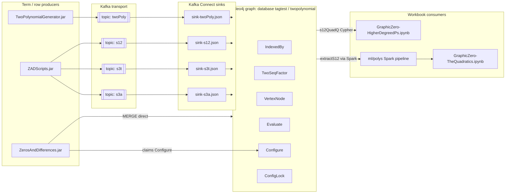

# From Graph Structure to Result Polynomial

A semantic and structural analysis of the end-to-end pipeline that starts at
`TwoPolynomialGenerator.jar` / `ZADScripts.jar` (and the `ZerosAndDifferences`
JAR), materializes a typed Neo4j graph, and is consumed by the parity workbooks:

- [`ml/polys/workbook/GraphicZero-TheQuadratics.ipynb`](workbook/GraphicZero-TheQuadratics.ipynb)
- [`ml/polys/workbook/GraphicZero-HigherDegreedPs.ipynb`](workbook/GraphicZero-HigherDegreedPs.ipynb)

The migrated notebooks preserve legacy Zeppelin checkpoint names (the `z`
dictionary) so this document can cite both the graph side and the notebook side
with a single vocabulary.

---

## 1. High-level architecture



Two independent entry points build the **quadratic slice** of the graph
(`IndexedBy + VertexNode + TwoSeqFactor + Evaluate`):

- **Kafka path:** `TwoPolynomialGenerator.jar` emits per-term JSON rows to
  the `twoPoly` topic; `kafka-connect/sink-twoPoly.json` MERGEs them into Neo4j.
- **Direct JVM path:** `ZerosAndDifferences.jar` writes the same node/edge
  set via its own Neo4j JDBC connection (`zaddbTable1` / `CypherArithmetic`).

`ZADScripts.jar` is **mostly a downstream reader**: it runs Cypher against the
graph (`s12QuadQ`, `s12Dc`, `s3TEc`, `s3ADc`, …) and republishes enriched
records to Kafka (`s12`, `s3t`, `s3a`), which `kafka-connect/sink-s12.json` et
al. materialize as `ArgumentsNode`, `CollectedProductArgNode`, etc. The
workbooks re-run the `s12QuadQ` Cypher (or consume its Spark-extracted parquet
equivalent) to rebuild the s12 table locally.

---

## 2. Producer contributions

### 2.1 `TwoPolynomialGenerator.jar`

Driver script: [`kafka-connect/run_TwoPolynomialGenerator.ps1`](../../kafka-connect/run_TwoPolynomialGenerator.ps1)

```
java -jar TwoPolynomialGenerator.jar test.csv 8 2 9
java -jar TwoPolynomialGenerator.jar test.csv 16 2 17
...
```

Arguments map to:

| Position | Meaning | Graph role |
|----------|---------|-----------|
| 1 | CSV output file name | Local flat file, not persisted in graph |
| 2 | `MaxN` / outer ceiling index | `IndexedBy.MaxN` |
| 3 | fixed `2` — dimension | `IndexedBy.Dimension = '2'` |
| 4 | Upper scan bound (typically `MaxN + 1`) | Controls how many `N` rows are written |

The generator walks polynomial term expansions and emits one JSON record per
term to Kafka topic `twoPoly`. Each record contains, at minimum:

- `NN`              — the running index `N` (drives `IndexedBy.N`)
- `nMaxx`           — the run's `MaxN` (drives `IndexedBy.MaxN`)
- `flatFileRowCounterr` — row counter within the flat file (`IndexedBy.RowCounter`)
- `tSeqDB`          — the two-sequence factor (`TwoSeqFactor.twoSeq`, the row scalar)
- `vertexDBVertex`, `vertexScalarDB`, `vertexDegreeDB` — the term itself as a
  `VertexNode` (vertex label, integer scalar, polynomial degree)
- `targetEvaluate`  — `2^N`, materialized as `Evaluate.Value`

The sink Cypher in [`kafka-connect/sink-twoPoly.json`](../../kafka-connect/sink-twoPoly.json)
is exactly:

```cypher
MERGE (i:IndexedBy {N:event.NN, RowCounter:event.flatFileRowCounterr, MaxN:event.nMaxx, Dimension:'2'})
MERGE (t:TwoSeqFactor {twoSeq:event.tSeqDB})
MERGE (v:VertexNode {Vertex:event.vertexDBVertex, Scalar:event.vertexScalarDB, Degree:event.vertexDegreeDB})
MERGE (e:Evaluate   {Value:event.targetEvaluate})
MERGE (i)-[:TwoFactor]->(t)
MERGE (i)-[:IndexedByEvaluate]->(e)
MERGE (i)-[:VertexIndexedBy]->(v)
```

Semantically this says: for a given `(N, MaxN)` anchor, a **chain of polynomial
terms** (`VertexNode`s — one per degree contribution) is indexed, paired with
a **two-sequence row scalar** (`TwoSeqFactor`), and associated with its
**evaluation target** `Evaluate.Value = 2^N`. That is the primitive ingredient
the workbooks later re-aggregate into reduced polynomials.

### 2.2 `ZerosAndDifferences.jar` (direct MERGE writer)

Orchestration: [`ml/spark_graph_builder/run_zad_batches.ps1`](../spark_graph_builder/run_zad_batches.ps1)

This script drains a queue of `:Configure` seed nodes by spawning N copies of
the JAR. Each worker:

1. Atomically claims one `:Configure` node using `GaussTable1.configureQuery1()`
   (a guarded `MATCH ... DELETE` wrapped by `ConfigLock {name:'configure-queue'}`
   rotating a `randomUUID()` token).
2. Reads configuration fields off the `:Configure` node:
   `setProductRange`, `setProductRAngeIncrement`, `maxSetProductRange`,
   `dimension`, `maxFigPScalar`, `integerRange`, `pArray`.
3. Runs the two-polynomial / Gauss loop
   ([`zaddbTable1`](../../ZerosAndDifferences033021/src/twopolynomial/zaddbTable1.java),
    [`CypherArithmetic`](../../ZerosAndDifferences033021/src/twopolynomial/CypherArithmetic.java))
   and writes directly via JDBC:

```cypher
MERGE (v:VertexNode    {Vertex:?, Scalar:?, Degree:?})
MERGE (d:TwoSeqFactor  {twoSeq:?})
MERGE (d:IndexedBy     {N:?, RowCounter:?, MaxN:?})
MERGE (e:Evaluate      {Value:?})
```

plus the corresponding `:VertexIndexedBy`, `:TwoFactor`, `:IndexedByEvaluate`
edges. The shape is identical to the sink path; the difference is that
`IndexedBy.Dimension` is not always written in the direct path, whereas the
Kafka sink **always** sets `Dimension:'2'`.

This path also writes Gauss / differences side artifacts (`Dnode`, `zMap`,
`CreatedBy`) that are out of scope for the two notebooks but share the same
`IndexedBy` anchor.

### 2.3 `ZADScripts.jar` (reader + republisher)

Driver script: [`kafka-connect/run_ZADScripts.ps1`](../../kafka-connect/run_ZADScripts.ps1)

```
java -jar ZADScripts.jar 2 7  8 2
java -jar ZADScripts.jar 2 7  8 8
java -jar ZADScripts.jar 2 13 16 32
...
```

CLI positions map to
[`ScriptParameters`](../../ZADScriptsK/ZADScripts/src/zadscripts/ScriptParameters.java):

| Pos | Name | Notes |
|-----|------|-------|
| 1 | `lowRange` | Cypher `range(lowRange, highRange)` on `N` |
| 2 | `highRange` | `N` upper bound |
| 3 | `index` | Bound to `nMax` / `i.MaxN` in Cypher |
| 4 | `readDimension1 == readDimension2` | Drives `writeDimension` scaling in `main` |

[`ZADScripts.main`](../../ZADScriptsK/ZADScripts/src/zadscripts/ZADScripts.java)
builds a Kafka producer, then delegates to `ScriptScheduler.scheduler()`, which
calls the methods in
[`ScriptsAutomation`](../../ZADScriptsK/ZADScripts/src/zadscripts/ScriptsAutomation.java)
(`s12Initial`, `pollS12`, `s3TEc`, `s3ADc`, …). Those methods run Cypher via
[`DFScripts`](../../ZADScriptsK/ZADScripts/src/zadscripts/DFScripts.java) and
publish enriched rows to topics `s12`, `s3t`, `s3a`. The connect sinks then
MERGE those into downstream node labels (e.g. `ArgumentsNode`,
`CollectedProductArgNode`).

**Crucially for the notebooks:** `DFScripts.s12QuadQ(rangeLow, rangeHigh, index)`
— the same Cypher reproduced inside
[`ml/polys/workbook/GraphicZero-HigherDegreedPs.ipynb`](workbook/GraphicZero-HigherDegreedPs.ipynb) —
folds the `degree = -1` remainder into `degree = 0` with `scalar * 2`:

```cypher
UNWIND range(toInteger($rangeLow), toInteger($rangeHigh)) AS n
WITH toString(n) AS N, $index AS nMax
MATCH (v:VertexNode)<-[]-(i:IndexedBy)-[]->(:Evaluate),
      (t:TwoSeqFactor)<-[]-(i)
WHERE i.N = N AND i.MaxN = nMax AND i.Dimension = '2'
RETURN i.N        AS index,
       i.MaxN     AS maxN,
       t.twoSeq   AS rowScalar,
       '2'        AS divisor,
       // degree=-1 -> scalar doubled
       toString(CASE WHEN toString(v.Degree)='-1'
                     THEN toInteger(v.Scalar) * 2
                     ELSE toInteger(v.Scalar) END) AS scalar,
       // degree=-1 -> folded to 0
       toString(CASE WHEN toString(v.Degree)='-1'
                     THEN 0
                     ELSE toInteger(v.Degree) END) AS degree
```

The `divisor = 2` constant is the historical **Zeppelin parity divisor**
the notebooks preserve under the `ALIGN_LEGACY_ZEPPELIN_DIVISOR` flag.

---

## 3. Graph schema as a typed knowledge structure

| Label / Property | Source | Mathematical role |
|------------------|--------|-------------------|
| `IndexedBy.N` | `NN` from generator / `N` from ZAD | Inner index of a polynomial row |
| `IndexedBy.MaxN` | `nMaxx` / arg 3 | Horizon / evaluation point |
| `IndexedBy.Dimension = '2'` | sink literal | Marks the quadratic slice |
| `IndexedBy.RowCounter` | `flatFileRowCounterr` | Per-row ordinal within one polynomial |
| `TwoSeqFactor.twoSeq` | `tSeqDB` | `rowScalar` in workbook vocabulary; the power-of-two track multiplier |
| `VertexNode.Scalar` | `vertexScalarDB` | Integer coefficient of a single term |
| `VertexNode.Degree` | `vertexDegreeDB` | Polynomial degree of that term (`-1` is the Laurent remainder, folded) |
| `VertexNode.Vertex` | `vertexDBVertex` | Stringified term identity (for traceability) |
| `Evaluate.Value` | `targetEvaluate` | `2^N` — the value the row is asserted to evaluate to |

Relationships:

- `(IndexedBy)-[:VertexIndexedBy]->(VertexNode)` — terms belonging to a row
- `(IndexedBy)-[:TwoFactor]->(TwoSeqFactor)` — the row's scalar track
- `(IndexedBy)-[:IndexedByEvaluate]->(Evaluate)` — the evaluation target

A single `IndexedBy` node is therefore a **typed tuple** `(N, MaxN, RowCounter)`
whose outgoing edges reify:
- the **polynomial skeleton** (a set of `VertexNode`s, one per degree),
- the **row multiplier** (`TwoSeqFactor.twoSeq`),
- and the **target value** (`Evaluate.Value = 2^N`).

This is enough structure for the workbook to reconstruct the reduced polynomial
`p_N(x)` whose evaluation at `x = MaxN` should equal `2^N`.

---

## 4. Workbook consumption: from terms to reduced polynomials

Both notebooks keep Zeppelin checkpoint names in a Python `z` dictionary. The
quadratics notebook zooms into one `N` (deep slice); the higher-degreed notebook
runs the same pipeline across a **range of N** at a fixed `MaxN = 8`.

### 4.1 Shared stage flow

```mermaid
flowchart TD
    A[Graph query / extractS12 Parquet] --> B[s12MaxN8]
    B --> C[rUdfMaxN8<br/>evaluated terms]
    C --> D1[KvDS -> KvDSUnpavked<br/>sum raw scalars per rowScalar, degree]
    D1 --> E1[pivotDF<br/>per rowScalar quadratic a,b,c]
    E1 --> F1[RootsMaxn8Range<br/>roots of per-row quadratic]
    C --> D2[KvDegreeDS -> KvDegreeDSUnpavked<br/>sum scalar*rowScalar/divisor]
    D2 --> E2[ReducedMaxN8Range<br/>reduced polynomial coefficients]
    E2 --> F2[ReducedMaxN8RangePivot<br/>p_N in coefficient form]
    E2 --> G[ReducedMaxN8RangeResult<br/>termwise p_N(MaxN)]
    G --> H[ReducedMaxN8RangeResultPivot<br/>per-degree breakdown]
    G --> I[ReducedMaxN8RangeFinalResult<br/>p_N(MaxN) scalar]
```

### 4.2 Meaning of each stage

- **`s12MaxN8`** — The raw s12 table. One row per `(N, rowScalar, degree)`
  contribution, with the legacy fold applied. It is the graph-to-table
  projection of the Cypher described in §2.3, or the Parquet equivalent
  produced by the `ml/polys` Spark job.
- **`rUdfMaxN8`** — Each row evaluated at `x = MaxN`:
  `result = (scalar / divisor) * MaxN^degree * rowScalar`. This is the
  monomial contribution, **pre-aggregation**.
- **`KvDS` / `KvDSUnpavked`** — Sum raw integer `scalar`s by
  `(N, rowScalar, degree)`. This collapses all terms of a given degree on a
  given `rowScalar` track into one integer coefficient. It does **not** divide
  by the divisor; it stays in coefficient space.
- **`pivotDF`** — Pivot those coefficients by degree into
  `(N, rowScalar) -> { 0: c, 1: b, 2: a }`. Each row is a concrete quadratic
  `ax^2 + bx + c` associated with a single chain / two-sequence factor.
- **`RootsMaxn8Range`** — Applies the quadratic formula with the half-scaling
  convention used in the legacy code
  (`a_m = rowScalar * a / 2`, `b_m = rowScalar * b / 2`, `c_m = rowScalar * c / 2`).
  For rows with `discriminant > 0` it emits the two real roots (often a
  **denumerated integer pair**, revealing that the term structure comes from
  consecutive-integer factor chains). `rowScalar = 1` frequently yields the
  `"no / root"` sentinel, confirming that the `rowScalar = 1` row is not a
  single quadratic in the two-argument sense — it is the constant + linear
  remainder described in the legacy notebook narrative.
- **`KvDegreeDS` / `KvDegreeDSUnpavked`** — Weighted aggregation
  `scalar * rowScalar / divisor`, grouped by `(MaxN, N, degree)`. This is the
  **reduction across rowScalar tracks**: many per-row quadratics collapse into
  one reduced polynomial per `(MaxN, N)`.
- **`ReducedMaxN8Range`** — Long/tidy form of the reduced coefficients.
- **`ReducedMaxN8RangePivot`** — Pivot by `N` into degree columns, yielding one
  reduced `p_N(x) = c_0 + c_1 x + c_2 x^2` per N.
- **`ReducedMaxN8RangeResult`** — Evaluate each reduced coefficient at
  `x = MaxN`: `result = Scalar * MaxN^degree` per term.
- **`ReducedMaxN8RangeResultPivot`** — Pivot by `(MaxN, N)` with degree columns;
  reveals how each degree contributes to the final value.
- **`ReducedMaxN8RangeFinalResult`** — Sum the evaluated terms into
  `index_Result = p_N(MaxN)` per `(MaxN, N)`. For `MaxN = 8` and `N ∈ {2..7}`,
  this column reproduces **4, 8, 16, 32, 64, 128**, i.e. **`2^N`**, matching
  the `Evaluate.Value` assertion stored in the graph.

### 4.3 Quadratics vs Higher-degreed: what differs

| Aspect | `GraphicZero-TheQuadratics.ipynb` | `GraphicZero-HigherDegreedPs.ipynb` |
|--------|------------------------------------|-------------------------------------|
| Data source | Parquet (`extractS12` stage of `ml/polys`) | Live Neo4j Cypher (`s12QuadQ`-equivalent) |
| N handling | Filters to `index = 7`, then aggregates | Keeps `N = 2..7`, aggregates per N |
| Roots table | `Rootsmaxn8n7` (only for N=7) | `RootsMaxn8Range` (N column included) |
| Reduced path | `ReducedMaxN8N7*` (single N) | `ReducedMaxN8Range*` (one row per N) |
| Final numeric | `ReducedMaxN8N7FinalResult = 128` for N=7 | `ReducedMaxN8RangeFinalResult = {4,8,16,32,64,128}` |
| Purpose | Deep parity for one index with ODS spreadsheet | Range of reduced p's — shows the `2^N` family |

Both are the **same** algebraic machinery. The higher-degreed notebook simply
does not collapse the outer `N` dimension, so it outputs a family of reduced
polynomials and their evaluations, one per `N`.

---

## 5. What the pipeline proves, end-to-end

Reading left-to-right in §1:

1. **Producers** (`TwoPolynomialGenerator.jar`, `ZerosAndDifferences.jar`)
   assert a structural claim: "for each `(N, MaxN, rowScalar)` chain, this is
   the finite set of polynomial terms (`VertexNode`s) whose weighted sum equals
   `2^N`." The graph stores the assertion `Evaluate.Value = 2^N` explicitly.
2. **`ZADScripts.jar`** re-queries the graph and republishes enriched rows;
   `s12QuadQ` normalizes the Laurent remainder (degree `-1`) into the
   conventional integer-degree basis used by the workbooks.
3. **The workbooks** consume the same s12 table and **recompute the evaluation
   without relying on `Evaluate.Value`**. The `ReducedMaxN8RangeFinalResult`
   column produced from `(scalar, divisor, rowScalar, degree, maxN)` alone
   reproduces `2^N` for `N = 2..7` at `MaxN = 8`. This closes the loop: the
   polynomial structure in the graph is **not merely labelled** with its value
   target — it **evaluates** to that target.

In other words, the graph encodes a polynomial identity; the workbooks verify
it numerically and expose intermediate structural artifacts (per-row quadratic
roots, reduced-coefficient polynomial per N, per-degree evaluation breakdown)
along the way.

---

## 6. Reproducing the full chain locally

1. **Populate the graph.** Either:
   - Run `kafka-connect/create-topics.ps1`, bring up Kafka Connect with the
     `sink-twoPoly.json` and `sink-s12.json` configs, and execute
     `kafka-connect/run_TwoPolynomialGenerator.ps1` + `kafka-connect/run_ZADScripts.ps1`.
   - Or, seed `:Configure` nodes in Neo4j and run
     `ml/spark_graph_builder/run_zad_batches.ps1` to drain them with
     `ZerosAndDifferences.jar`.
2. **Configure credentials.** Copy
   [`ml/polys/db.properties.example`](db.properties.example) to
   `ml/polys/db.properties` and set `neo4j.url`, `neo4j.user`,
   `neo4j.password`, `neo4j.database`.
3. **Run the notebooks.**
   - `GraphicZero-TheQuadratics.ipynb` reads Parquet from the
     `ml/polys` pipeline — run `ml/polys/run_polys.ps1` first to produce
     `extractS12` artifacts.
   - `GraphicZero-HigherDegreedPs.ipynb` reads Neo4j live via the `neo4j`
     Python driver — `pip install neo4j pandas`, then execute cells in order.

Both notebooks contain stage-level schema and row-count assertions that fail
early if an upstream step is missing.

---

## 7. Glossary (one-line recap)

- **TwoPolynomialGenerator.jar** — writes term-level JSON rows to Kafka
  `twoPoly`; becomes `IndexedBy`, `VertexNode`, `TwoSeqFactor`, `Evaluate`.
- **ZerosAndDifferences.jar** — drains `:Configure` queue; directly MERGEs the
  same base quadratic graph structure via Neo4j JDBC.
- **ZADScripts.jar** — runs `s12QuadQ`/`s12Dc`/`s3TEc`/`s3ADc` Cypher and
  republishes to Kafka; its `s12QuadQ` query is the reference shape the
  workbooks replicate.
- **s12 table** — flat `(index, maxN, rowScalar, divisor, scalar, degree)`
  after the `degree == -1` fold.
- **Reduced polynomial** — sum of per-rowScalar quadratics into one polynomial
  per `(MaxN, N)` in coefficient form.
- **Final result** — `p_N(MaxN) = 2^N` reconstructed from graph structure
  alone.
